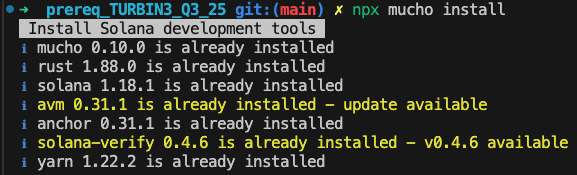

# Q3 25 Builder AQuental

Turbin3 builder cohort Q3 2025 - Antonio Quental

---

#  Turbin3 Q3 25

## setup

[reference video](https://www.youtube.com/watch?v=4UfDM27nWkI)

- Setting up the computer (Solana CLI, Solana Tool Suite, Rust, and Anchor).
  <details>
  <summary>Documentation reference:</summary>

  - [Solana Toolkit Docs](https://solana.com/docs/toolkit/getting-started)
  - [Solana Installation Docs](https://solana.com/docs/intro/installation)
  - [Test Validator Guide](https://solana.com/developers/guides/getstarted/solana-test-validator)
  - Block explorers
    - [Solscan](https://solscan.io/)
    - [Solana FM](https://solana.fm/)
  - [Solana RPC endpoint docs](https://solana.com/docs/references/clusters)
  </details>

  ```shell
  $ npx mucho install
  ```

  

- Running a [local test validator](https://solana.com/developers/guides/getstarted/solana-test-validator), and setting up all the configurations.
- Understanding different solana clusters and how to use them.

```shell
solana-test-validator
```

**Cohort Q3** / 2025

wallet: `Dn2ucNUVe5ptVueYRKf6m6effxs13RJpjJEMfEL9yMzG`

# Codebase Index

- Prerequisite
  - [TypeScript pre req](./typescript/README.md)
  - [Rust pre req](./rust/README.md)
- Week 1
  - [vault](./vault/README.md)
