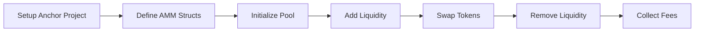

# AMM using Anchor



### **Step-by-Step Breakdown** (with Anchor/Rust)

---

#### **1. Setup Anchor Project**
```bash
anchor init solana-amm
cd solana-amm
anchor build
```

---

#### **2. Define AMM Structs (Rust)**
```rust
// State account holding pool data
#[account]
pub struct Pool {
    pub token_a: Pubkey,          // Mint address of token A (e.g., SOL)
    pub token_b: Pubkey,          // Mint address of token B (e.g., USDC)
    pub reserve_a: u64,           // Amount of token A in pool
    pub reserve_b: u64,           // Amount of token B in pool
    pub lp_token_mint: Pubkey,    // LP token mint address
    pub fee_bps: u16,             // Swap fee (e.g., 30 = 0.3%)
}

// Accounts needed for swaps
pub struct Swap<'info> {
    #[account(mut)]
    pub pool: Account<'info, Pool>,
    #[account(mut)]
    pub user_token_a: Account<'info, TokenAccount>,
    // ... other accounts (token B, LP token, etc.)
}
```

---

#### **3. Initialize Pool**
```rust
#[derive(Accounts)]
pub struct InitializePool<'info> {
    #[account(init, payer = user, space = 8 + 32*3 + 8*2 + 2)]
    pub pool: Account<'info, Pool>,
    pub token_a: Account<'info, Mint>,
    pub token_b: Account<'info, Mint>,
    // ... other constraints (e.g., LP token mint)
}

#[program]
pub fn initialize_pool(ctx: Context<InitializePool>) -> Result<()> {
    ctx.accounts.pool.token_a = ctx.accounts.token_a.key();
    ctx.accounts.pool.token_b = ctx.accounts.token_b.key();
    ctx.accounts.pool.fee_bps = 30; // 0.3% fee
    Ok(())
}
```
- Creates a new pool with two tokens and an LP token mint.

---

#### **4. Add Liquidity**
```rust
#[program]
pub fn add_liquidity(
    ctx: Context<AddLiquidity>,
    amount_a: u64,
    amount_b: u64,
) -> Result<()> {
    // Transfer tokens from user to pool
    transfer_tokens(ctx.accounts.user_token_a, ctx.accounts.pool_token_a, amount_a)?;
    transfer_tokens(ctx.accounts.user_token_b, ctx.accounts.pool_token_b, amount_b)?;

    // Mint LP tokens proportional to liquidity added
    let lp_amount = calculate_lp_tokens(amount_a, amount_b);
    mint_tokens(ctx.accounts.lp_token_mint, ctx.accounts.user_lp_token, lp_amount)?;

    // Update pool reserves
    ctx.accounts.pool.reserve_a += amount_a;
    ctx.accounts.pool.reserve_b += amount_b;
    Ok(())
}
```
- Uses **`x * y = k`** to ensure liquidity matches the pool's ratio.

---

#### **5. Swap Tokens (Constant Product Formula)**
```rust
#[program]
pub fn swap_a_to_b(ctx: Context<Swap>, amount_in: u64) -> Result<()> {
    let fee = amount_in * ctx.accounts.pool.fee_bps as u64 / 10_000;
    let amount_in_after_fee = amount_in - fee;

    // Calculate output using x*y=k
    let reserve_a = ctx.accounts.pool.reserve_a;
    let reserve_b = ctx.accounts.pool.reserve_b;
    let amount_out = (reserve_b * amount_in_after_fee) / (reserve_a + amount_in_after_fee);

    // Update reserves
    ctx.accounts.pool.reserve_a += amount_in;
    ctx.accounts.pool.reserve_b -= amount_out;

    // Transfer tokens
    transfer_tokens(ctx.accounts.user_token_a, ctx.accounts.pool_token_a, amount_in)?;
    transfer_tokens(ctx.accounts.pool_token_b, ctx.accounts.user_token_b, amount_out)?;
    Ok(())
}
```

---

#### **6. Remove Liquidity**
```rust
#[program]
pub fn remove_liquidity(ctx: Context<RemoveLiquidity>, lp_amount: u64) -> Result<()> {
    // Calculate share of pool
    let share = lp_amount as f64 / total_lp_supply as f64;
    let amount_a = (ctx.accounts.pool.reserve_a as f64 * share) as u64;
    let amount_b = (ctx.accounts.pool.reserve_b as f64 * share) as u64;

    // Burn LP tokens and return assets
    burn_tokens(ctx.accounts.user_lp_token, lp_amount)?;
    transfer_tokens(ctx.accounts.pool_token_a, ctx.accounts.user_token_a, amount_a)?;
    transfer_tokens(ctx.accounts.pool_token_b, ctx.accounts.user_token_b, amount_b)?;

    // Update reserves
    ctx.accounts.pool.reserve_a -= amount_a;
    ctx.accounts.pool.reserve_b -= amount_b;
    Ok(())
}
```

---

### **Key Dependencies (Anchor)**
- **`anchor_spl`**: For token transfers/minting.  
- **`anchor_lang`**: Core macros (e.g., `#[account]`, `#[program]`).  
- **`spl_token`**: Solana Program Library token standard.  

### **Testing**
```typescript
// Anchor test (Typescript)
it("Swaps SOL for USDC", async () => {
  await program.methods
    .swapAtoB(new anchor.BN(1_000_000)) // 1 SOL
    .accounts({ pool: poolPDA })
    .rpc();
});
```

---

### **Next Steps**
1. Add **price impact/slippage checks**.  
2. Implement **concentrated liquidity** (like Uniswap v3).  
3. Add **flash loan support**.  
