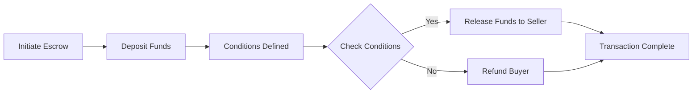

# Escrow

## concept

An _escrow_ is a program that temporarily holds and controls funds or assets until predefined conditions are met. It acts as a neutral third party, ensuring that both parties in a transaction fulfill their obligations before the assets are released.



## actions

- Initiate Escrow
  - Buyer and seller agree to terms (e.g., NFT sale, token swap).
  - A Solana smart contract (escrow program) is deployed or reused.
- Deposit Funds
  - Buyer sends funds (SOL/SPL tokens) to the escrow account.
  - Funds are locked in the contract until conditions are fulfilled.
- Conditions Defined
  - The contract encodes release logic (e.g., NFT delivery confirmation, expiration time, or multisig approval).
- Check Conditions
  - The contract checks if the agreed-upon conditions (e.g., proof of delivery) are met.
  - This can be triggered by:
    - An on-chain event (e.g., NFT transfer).
    - An off-chain oracle or signed message.
- Release Funds or Refund
  - Conditions Met (_Yes_): Funds are automatically sent to the seller.
  - Conditions Not Met (_No_): Funds are returned to the buyer (e.g., if the seller fails to deliver).
- Transaction Complete
  - The escrow account closes, and both parties receive confirmation on-chain.

# tests

[Test description](./anchor/tests/README.md)

```script
# Run all tests
anchor test

# Run specific test file
anchor test --skip-deploy tests/anchor-escrow.ts
anchor test --skip-deploy tests/escrow-edge-cases.ts
anchor test --skip-deploy tests/escrow-security.ts

# Run individual test
npx mocha tests/anchor-escrow.ts --grep "Successfully creates an escrow"
```
