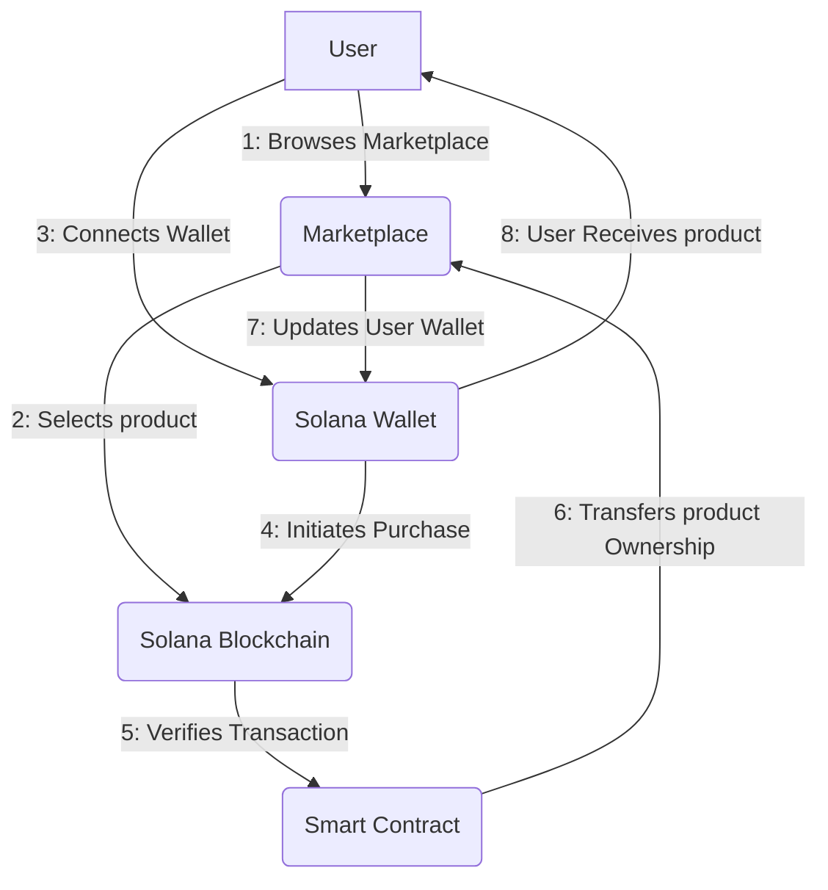

```mermaid
graph TD
    A[User] -->|1: Browses Marketplace| B(Marketplace)
    B -->|2: Selects product| C(Solana Blockchain)
    A -->|3: Connects Wallet| D(Solana Wallet)
    D -->|4: Initiates Purchase| C
    C -->|5: Verifies Transaction| E(Smart Contract)
    E -->|6: Transfers product Ownership| B
    B -->|7: Updates User Wallet| D
    D -->|8: User Receives product| A
```
