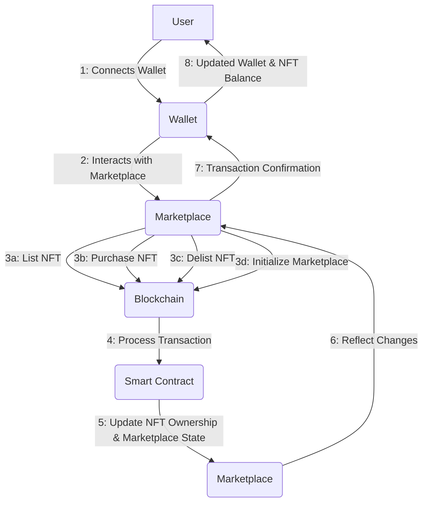

# Marketplace

A Solana-based NFT marketplace smart contract built with Anchor framework.

## Architecture



## Features

### Core Functionality
- **Initialize Marketplace** - Create a new marketplace instance with configurable fees
- **List NFT** - Put NFT up for sale with specified price
- **Purchase NFT** - Buy listed NFT with automatic fee distribution
- **Delist NFT** - Remove NFT from marketplace (seller only)

### Fee Management
- **Minimum Fee**: 1% (100 basis points) - Ensures platform sustainability
- **Maximum Fee**: 99% (9900 basis points) - Protects sellers from excessive fees
- **Automatic Fee Enforcement** - Out-of-range fees are automatically capped
- **Treasury Distribution** - Fees automatically sent to marketplace treasury

### Security Features
- **Ownership Validation** - Only NFT owners can list their items
- **Escrow System** - NFTs held in secure program-controlled vaults
- **PDA (Program Derived Address)** - Deterministic account generation
- **Account Validation** - Comprehensive checks on all transactions

## Test

The marketplace smart contract includes comprehensive tests covering all functionality and edge cases.

### Running Tests

```bash
# Run all tests
anchor test
```

### Test Coverage

#### Marketplace Initialization Tests
- ✅ **Initializes marketplace successfully** - Tests basic marketplace creation with valid parameters
- ✅ **Fails to initialize marketplace with same name twice** - Ensures unique marketplace names
- ✅ **Initializes marketplace with zero fee** - Tests minimum fee enforcement (0% → 1%)
- ✅ **Initializes marketplace with maximum fee** - Tests maximum fee enforcement (100% → 99%)
- ✅ **Enforces minimum fee for low fee values** - Tests fee floor (0.5% → 1%)
- ✅ **Enforces maximum fee for extreme values** - Tests fee ceiling (200% → 99%)

#### NFT Listing Tests
- ✅ **Lists an NFT successfully** - Tests basic NFT listing functionality
- ✅ **Lists NFT with different prices** - Tests multiple price points
- ✅ **Fails to list NFT without owning it** - Tests ownership validation
- ✅ **Fails to list with zero price** - Tests price validation (currently allows 0)

#### NFT Purchase Tests
- ✅ **Purchases NFT successfully** - Tests complete purchase flow with fee distribution
- ✅ **Fails to purchase non-existent listing** - Tests error handling for invalid listings
- ✅ **Fails to purchase with insufficient funds** - Tests balance validation

#### NFT Delisting Tests
- ✅ **Delists NFT successfully** - Tests NFT removal from marketplace
- ✅ **Fails to delist if not the maker** - Tests authorization validation

#### Edge Cases and Error Handling
- ✅ **Handles zero fee marketplace correctly** - Tests 1% minimum fee in practice
- ✅ **Handles maximum fee marketplace correctly** - Tests 99% maximum fee distribution
- ✅ **Handles concurrent listings of different NFTs** - Tests multiple simultaneous listings

#### Account State Verification
- ✅ **Verifies marketplace state persists correctly** - Tests data integrity
- ✅ **Verifies token account authorities are correct** - Tests PDA ownership

### Fee Enforcement

The marketplace enforces fee boundaries to ensure platform sustainability and seller protection:

- **Minimum Fee**: 1% (100 basis points) - Prevents zero or extremely low fees
- **Maximum Fee**: 99% (9900 basis points) - Prevents excessive fees that would harm sellers
- **Automatic Enforcement**: Out-of-range fees are automatically capped without transaction failure

### Test Results

```
20 passing (30s)
```

All tests validate:
- Proper fee calculation and distribution
- NFT ownership transfers
- Account state management
- Error handling for edge cases
- PDA (Program Derived Address) functionality
- SOL payment flows between buyer, seller, and treasury
