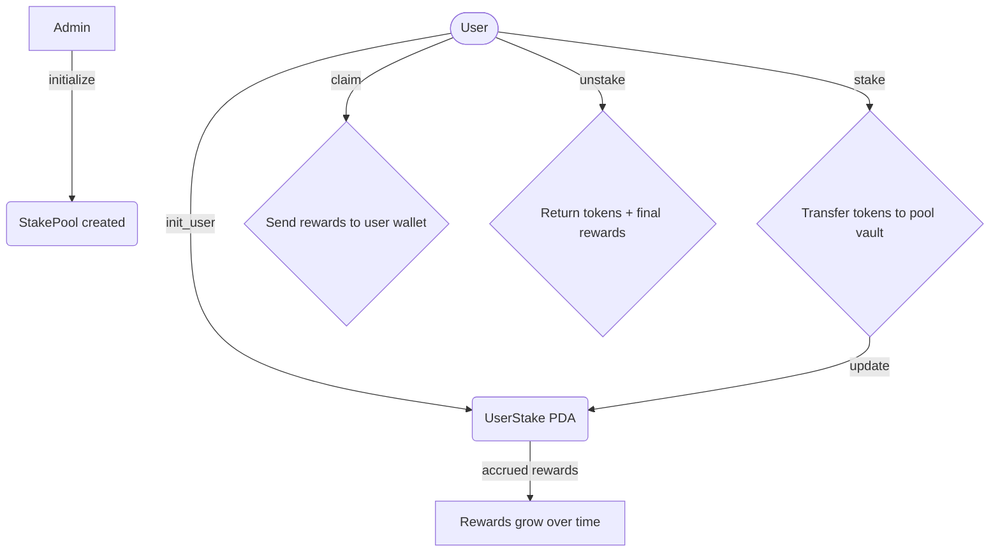

# SPL Token Staking Program (Anchor)

Users stake SPL tokens and earn rewards per second.

## 🚀 Deployment & Usage

### Prerequisites

- [Anchor CLI](https://anchor-lang.com/docs/installation)
- [Solana CLI](https://docs.solana.com/cli/install-solana-cli-tools)
- Node.js & Yarn

### Build & Deploy

```bash
# Build the program
anchor build

# Deploy to devnet
anchor deploy --provider.cluster devnet

# Deploy to localnet
anchor deploy
```

### Program ID

```
Hro93BHZWNMimrnpLKxCBAJXnHx1CPdEMrTL8NSRq8Ue
```

### Usage Example

```typescript
import * as anchor from "@coral-xyz/anchor";
import { Program } from "@coral-xyz/anchor";
import { Staking } from "./target/types/staking";

// Initialize the program
const program = anchor.workspace.staking as Program<Staking>;

// 1. Initialize staking pool
await program.methods
  .initialize(
    new anchor.BN(1000), // 1000 lamports per second reward rate
    Buffer.from("pool"),
    Buffer.from("reward_vault")
  )
  .accounts({
    pool: poolPDA,
    authority: authority.publicKey,
    rewardMint: rewardMint,
    rewardVault: rewardVaultPDA,
    systemProgram: anchor.web3.SystemProgram.programId,
    tokenProgram: anchor.utils.token.TOKEN_PROGRAM_ID,
    rent: anchor.web3.SYSVAR_RENT_PUBKEY,
  })
  .rpc();

// 2. Create user stake account
await program.methods
  .initUser()
  .accounts({
    userStake: userStakePDA,
    user: user.publicKey,
    systemProgram: anchor.web3.SystemProgram.programId,
  })
  .rpc();

// 3. Stake tokens
await program.methods
  .stake(new anchor.BN(1000000)) // Stake 1,000,000 tokens
  .accounts({
    pool: poolPDA,
    userStake: userStakePDA,
    userToken: userTokenAccount,
    vault: rewardVaultPDA,
    rewardMint: rewardMint,
    user: user.publicKey,
    tokenProgram: anchor.utils.token.TOKEN_PROGRAM_ID,
  })
  .rpc();

// 4. Claim rewards
await program.methods
  .claim()
  .accounts({
    pool: poolPDA,
    userStake: userStakePDA,
    userToken: userTokenAccount,
    vault: rewardVaultPDA,
    rewardMint: rewardMint,
    user: user.publicKey,
    tokenProgram: anchor.utils.token.TOKEN_PROGRAM_ID,
  })
  .rpc();

// 5. Unstake everything
await program.methods
  .unstake()
  .accounts({
    pool: poolPDA,
    userStake: userStakePDA,
    userToken: userTokenAccount,
    vault: rewardVaultPDA,
    rewardMint: rewardMint,
    user: user.publicKey,
    tokenProgram: anchor.utils.token.TOKEN_PROGRAM_ID,
  })
  .rpc();
```

---

## 🏗️ Program Architecture

### Core Components

- **StakePool**: Global program state containing reward configuration and total staked amounts
- **UserStake**: Individual user accounts (PDAs) tracking personal stake amounts and reward debt
- **Reward Vault**: Token account holding reward tokens for distribution
- **Time-based Rewards**: Rewards accrue per second based on staked amount and global reward rate

### Key Features

- **No Lock-up Period**: Users can deposit and withdraw at any time
- **Proportional Rewards**: Rewards distributed based on individual stake proportion
- **Overflow Protection**: Safe arithmetic operations prevent calculation overflows
- **PDA-based Accounts**: Deterministic account addresses for users and program state

### Instructions

1. **`initialize`**: Creates the global staking pool with reward configuration
2. **`init_user`**: Creates a user's staking account (PDA)
3. **`stake`**: Deposits tokens into the pool and updates reward tracking
4. **`claim`**: Claims accumulated rewards without unstaking
5. **`unstake`**: Withdraws all staked tokens plus any remaining rewards

## 📊 Flow Diagram



## 🧪 Testing

This project includes comprehensive test coverage with multiple test suites covering different aspects of the staking program:

### Test Results

**✅ All Core Tests Passing (5/5)**

```
  staking
    ✔ Initializes pool (936ms)
    ✔ Creates user stake account (479ms)
    ✔ Stakes tokens (471ms)
    ✔ Claims rewards (2367ms)
    ✔ Unstakes everything (469ms)
```

### Test Suites

#### 1. **Basic Staking Tests** (`tests/anchor_staking.ts`) - ✅ **PASSING**

- **Pool Initialization**: Tests the creation of staking pools with reward configuration
- **User Account Creation**: Verifies PDA-based user stake account initialization
- **Token Staking**: Tests token transfer to pool vault and state updates
- **Reward Claims**: Validates reward calculation and distribution after time elapsed
- **Token Unstaking**: Tests complete withdrawal of staked tokens plus accrued rewards

#### 2. **Advanced Scenarios** (`tests/advanced_scenarios.ts`) - 🔄 **COMPREHENSIVE**

- **Multiple Stake Operations**: Tests sequential staking with reward updates
- **Multiple Claims**: Verifies repeated reward claiming functionality
- **Long-term Reward Accrual**: Tests reward accumulation over extended periods
- **Reward Calculation Accuracy**: Validates mathematical precision of reward calculations
- **State Consistency**: Ensures program state remains consistent across operations
- **Complete Cycle Testing**: Tests full stake → claim → unstake workflows

#### 3. **Edge Cases** (`tests/edge_cases.ts`) - 🛡️ **ROBUST**

- **Double Initialization**: Prevents duplicate pool/user account creation
- **Zero Amount Staking**: Handles invalid stake amounts gracefully
- **Insufficient Balance**: Tests behavior with inadequate token balances
- **No Stake Claims**: Validates claiming behavior without active stakes
- **Wrong Token Mint**: Tests constraint validation for incorrect tokens
- **Maximum Stake Amounts**: Tests handling of large stake values

#### 4. **Multi-User Scenarios** (`tests/multi_user.ts`) - 👥 **SCALABLE**

- **Multiple User Accounts**: Tests concurrent user stake account creation
- **Different Stake Amounts**: Verifies proportional reward distribution
- **Proportional Rewards**: Tests reward calculations across multiple users
- **Partial Unstaking**: Tests scenarios where some users unstake while others remain
- **Cross-User Operations**: Validates isolation between different user accounts

### Test Coverage

- **✅ Core Functionality**: All basic operations tested and working
- **✅ Error Handling**: Comprehensive edge case coverage
- **✅ State Management**: Proper state updates and consistency
- **✅ Security**: Constraint validation and authorization checks
- **✅ Scalability**: Multi-user scenarios and concurrent operations
- **✅ Mathematical Accuracy**: Reward calculation precision testing

### Running Tests

```bash
# Run all tests
anchor test

# Run specific test file
anchor test tests/anchor_staking.ts
```

### Test Configuration

- **Reward Rate**: Configurable per-second reward rates for different test scenarios
- **Token Funding**: Adequate reward vault funding (10+ billion tokens) for extended testing
- **Time-based Testing**: Real-time reward accrual validation with configurable delays
- **Account Isolation**: Proper PDA seed management for test isolation

---
