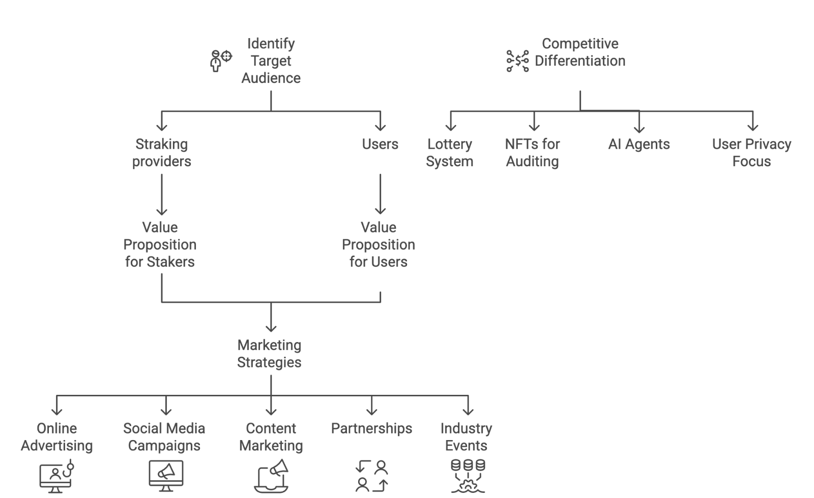

## Project Overview - WIP

:construction_worker:

:calendar: July 13

**Capstone Project Name/Idea**:
_Stake & Win_

**Brief Project Description**:
_Stake & Win_ is a decentralized platform built on the Solana blockchain that enables users to stake their tokens, earn staking rewards while participating in a lottery simultaneously. Users can choose to compound their staking rewards or withdraw them at any time.

**Reason for Choosing this Project**:
This project aims to gamify traditional staking platforms by offering a more engaging and rewarding experience for users or groups. Combining staking with a lottery system provides users with the potential for higher returns and increased excitement. Additionally, the project leverages Solana's decentralized finance (DeFi) ecosystem.

## Go-to-Market Strategy

**Target Audience**:
Crypto-enthusiasts, particularly those who hold SOL (or meme) tokens, are seeking passive income opportunities, as well as those interested in decentralized finance (DeFi) and blockchain-based gambling. This includes individuals with varying levels of experience, ranging from beginners to advanced, who seek higher returns on their investments.
**Value Proposition**:
_Stake & Win_ offers a unique value proposition by combining the benefits of staking with the thrill of a lottery. Users can earn competitive staking rewards while simultaneously participating in a weekly draw for a chance to win a significant portion of the collected staking fees.

## Marketing and Distribution

**Social Media**:
Utilize targeted advertising campaigns on platforms like Twitter, Discord, and Telegram to reach crypto communities and influencers.
**Content Marketing**:
Publish informative blog posts, articles, and videos that explain the platform's features, benefits, and how to use it effectively.
**Community Building**:
Foster a strong community around the platform through interactive channels like Discord and Telegram, engaging users with contests, giveaways, and regular updates.
**Partnerships**:
Collaborate with other DeFi projects, influencers, and crypto exchanges to expand reach and promote the platform.
**Competitive Landscape**:
??

**Differentiation**:
While other platforms offer staking and lottery services separately, _Stake & Win_ uniquely combines both features into a single, integrated platform. This provides users with a more convenient and rewarding experience.

## Technical Details

**Tech Stack**:
Blockchain: Solana
Programming Languages: Rust (Anchor, Leptos)
Smart Contract Development: Rust (for enhanced performance and security)
Frontend: React, JavaScript
Libraries:

- Solana Web3.js
- Anchor Framework
  Smart Contract Development:
  Programming Language: Rust
  **Testing**:
  Rigorous unit and integration testing will be conducted using established testing frameworks within the Rust ecosystem.
  **Security Audits**:
  Reputable blockchain security firms will perform Independent security audits to identify and mitigate potential vulnerabilities.
  **Disclaimer**:
  This is a hypothetical example and does not constitute financial advice. Investing in cryptocurrencies involves significant risks and may result in financial losses.

This template provides a basic framework. You can further customize it by adding details such as tokenomics, roadmap, and team information tailored to your specific project requirements.
