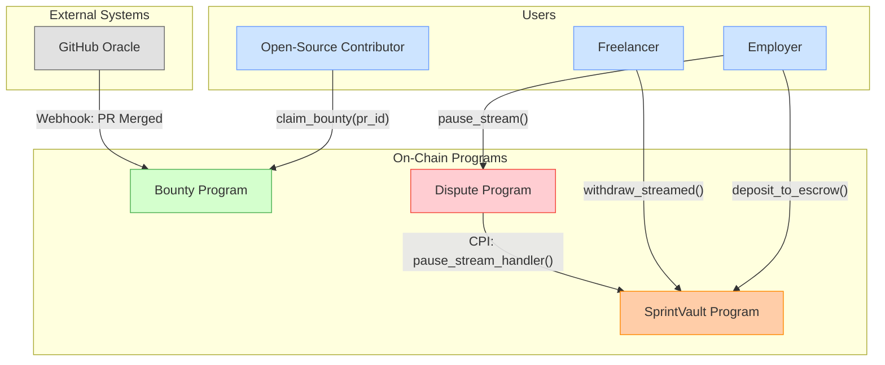
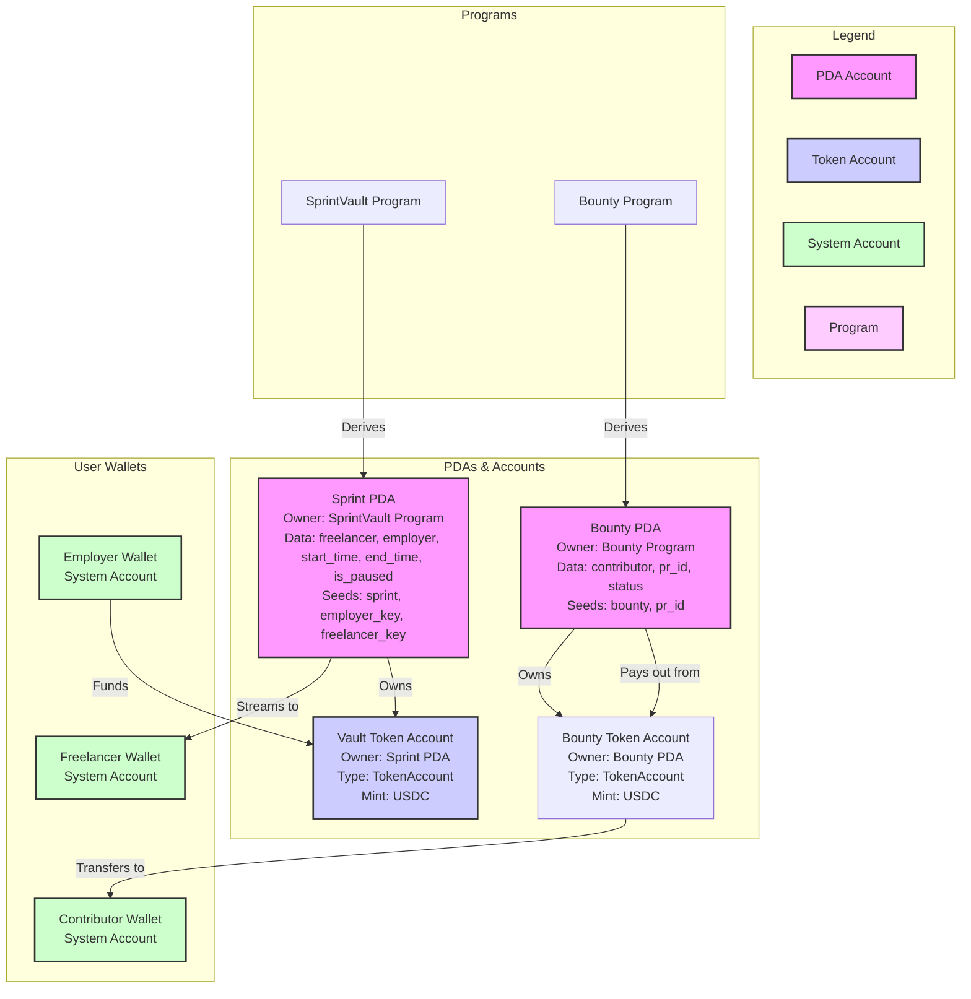
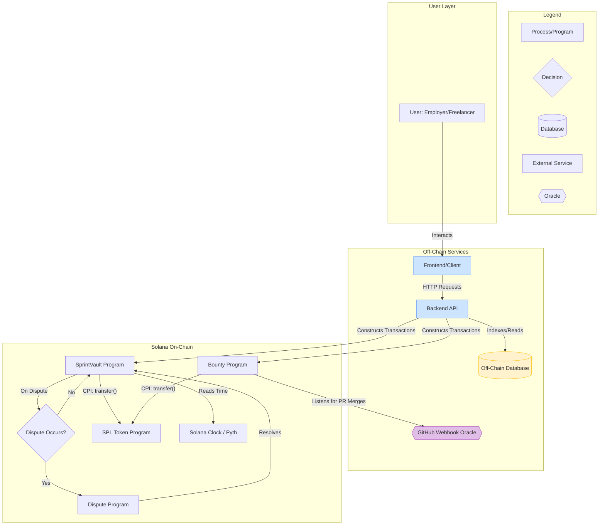
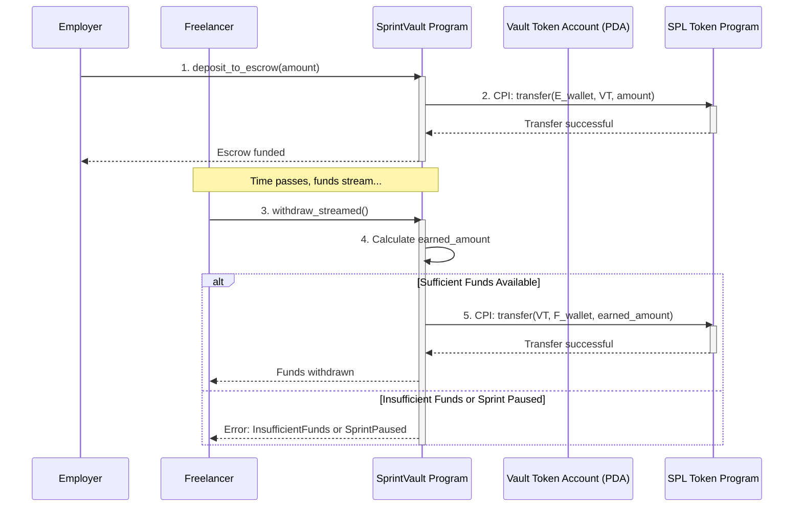

# SprintVault Protocol Architecture

This document outlines the high-level architecture for the SprintVault protocol, a decentralized system for milestone-based payments on Solana. It details the on-chain programs, their responsibilities, and the interactions between them.

---

## 1. Core Components & Program-Level Breakdown

The protocol is composed of three main on-chain programs and an external oracle integration, designed to be deployed on the Solana blockchain using the Anchor framework.

1. **SprintVault Program**: The core program responsible for creating and managing payment sprints, handling escrow deposits, and streaming payments to freelancers.
2. **Bounty Program**: Manages payments for open-source contributions, linking them to specific deliverables like GitHub Pull Requests.
3. **Dispute Program**: A specialized program to handle payment pauses and dispute resolution, acting as an arbitration layer.
4. **Oracle (GitHub Webhook)**: An external component that provides off-chain data (e.g., PR merge events) to trigger on-chain actions in the Bounty Program.

### 1.1 SprintVault Program

This is the central program that handles the core logic for scheduled, streaming payments.

**Responsibilities:**

- Create and configure payment sprints with specific durations and release rates.
- Accept and lock SPL tokens (USDC, SOL) into a secure escrow vault associated with a sprint.
- Calculate and stream payments to the freelancer's wallet based on the elapsed time.
- Allow freelancers to withdraw their earned funds at any time.
- Handle automatic refunds of unused funds to the employer if a sprint is not completed.
- Interface with the Dispute Program to pause or unpause payment streams.

**Key Anchor Instructions:**

- `create_sprint(freelancer, start_time, end_time, release_rate)`
- `deposit_to_escrow(amount)`
- `withdraw_streamed()`
- `get_earned_amount()`
- `auto_refund()`
- `pause_stream_handler()` (Internal, called by Dispute Program)

### 1.2 Bounty Program

This program is designed to facilitate payments for task-based work, such as open-source contributions.

**Responsibilities:**

- Manage dedicated, pre-funded bounty pools.
- Allow contributors to claim a bounty for a specific task (e.g., a GitHub issue).
- Link bounties to off-chain deliverables via an ID (`pr_id`).
- Listen for oracle validation (e.g., a GitHub webhook indicating a PR was merged).
- Trigger the release of bounty payments upon successful validation.

**Key Anchor Instructions:**

- `create_bounty_pool(amount)`
- `claim_bounty(pr_id)`
- `release_bounty(pr_id)` (Triggered by oracle)
- `get_bounty_balance(bounty_id)`

### 1.3 Dispute Program

This program acts as a governance and arbitration layer to manage conflicts between employers and freelancers.

**Responsibilities:**

- Provide a mechanism for employers to pause a payment stream if they believe work is not being delivered as agreed.
- Hold the stream in a "paused" state, preventing further withdrawals.
- Allow a designated governance body (e.g., a multisig wallet) to resolve the dispute and either resume or terminate the stream.

**Key Anchor Instructions:**

- `pause_stream(sprint_id)`
- `resolve_dispute(sprint_id, resolution_action)`

### System Interaction Diagram



### Data and Control Flow

1. **Happy Path (Freelancer Payroll)**:

   - An **Employer (A)** calls `deposit_to_escrow()` on the **SprintVault Program (P1)** to fund a sprint.
   - Funds are now locked in the vault.
   - The **Freelancer (B)** can call `withdraw_streamed()` at any time on **P1** to claim their real-time earnings.

2. **Open-Source Bounty Flow**:

   - An **Open-Source Contributor (C)** finds a task and calls `claim_bounty()` on the **Bounty Program (P2)**.
   - Upon completing the work, the **GitHub Oracle (O)** sends a webhook to **P2**.
   - **P2** validates the work and releases the payment directly from its own pre-funded bounty pool to the contributor's wallet.

3. **Dispute Flow**:
   - If there is an issue, the **Employer (A)** calls `pause_stream()` on the **Dispute Program (P3)**.
   - **P3** then makes a CPI to the **SprintVault Program (P1)** to pause the stream, preventing further withdrawals until the dispute is resolved by governance.

---

## 2. Account Structure Mapping

This section provides a visual representation of the key accounts used in the SprintVault protocol, their relationships, and how they are derived. The diagram below shows how Program-Derived Addresses (PDAs) are used to create secure, program-owned accounts for sprints, bounties, and vaults.



### Account Descriptions

1. **Sprint PDA**: A Program-Derived Address owned by the **SprintVault Program**. It holds the state of a specific payment sprint, including references to the employer and freelancer, timing information, and the current status.

   - **Derivation**: It is derived using the seeds `["sprint", employer_key, freelancer_key]`, ensuring that each sprint between an employer and a freelancer has a unique, deterministic address.

2. **Vault Token Account**: A standard SPL Token Account that holds the funds for a sprint (e.g., USDC). This account is owned by the **Sprint PDA**, meaning only the **SprintVault Program** can authorize transactions from it. This is the core of the escrow mechanism.

3. **Bounty PDA**: A Program-Derived Address owned by the **Bounty Program**. It tracks the state of an open-source bounty, linking a specific pull request (`pr_id`) to a contributor's wallet.

   - **Derivation**: It is derived using the seeds `["bounty", pr_id]`, which guarantees a unique account for each bounty.

4. **User Wallets**: These are standard system accounts representing the wallets of the **Employer**, **Freelancer**, and **Open-Source Contributor**. They are the source and destination of funds in the protocol.

---

## 3. External Dependencies and Integrations

This section provides a detailed overview of the external systems and on-chain programs that SprintVault interacts with. It showcases the modularity of the protocol and the clear separation of concerns between different components.

### System and Dependencies Flowchart



### Token and Account Interaction (Sequence Diagram)



### Description of Flows and Integrations

1. **Frontend and Backend Interaction**:

   - Users interact with a **Frontend** application, which communicates with a **Backend API**. The backend is responsible for constructing and submitting transactions to the Solana network and indexing on-chain data into an **Off-Chain Database** for efficient querying.

2. **Oracle Integration (GitHub)**:

   - The **Bounty Program** relies on a **GitHub Webhook Oracle** to receive external data. When a pull request is merged, the oracle calls the `release_bounty` instruction on the program to trigger an automatic payment.

3. **Dispute Resolution Flow**:

   - If a dispute arises, the system follows a clear path: a decision point (`Dispute Occurs?`) diverts the flow to the **Dispute Program**. This program acts as a modular arbitration layer, which can then interact with the core **SprintVault Program** to pause or resolve the payment stream.

4. **On-Chain Program Modularity**:

   - The architecture emphasizes a clear separation of concerns:
     - **SprintVault Program** handles the core payment and escrow logic.
     - **Bounty Program** manages task-based payments.
     - **Dispute Program** isolates complex arbitration logic.
   - This modularity allows for independent upgrades and maintenance.

5. **Token Interaction Sequence**:
   - The sequence diagram shows how the protocol leverages the Solana Programming Model:
     - The **Employer** initiates the process by calling the `deposit_to_escrow` function.
     - The **SprintVault Program** makes a Cross-Program Invocation (CPI) to the **SPL Token Program** to securely transfer funds into the **Vault Token Account** (owned by a PDA).
     - When the **Freelancer** withdraws, the program again makes a CPI to the **SPL Token Program** to transfer the earned amount from the vault to the freelancer's wallet.

---

## 4. Detailed Architecture and Component Interactions

This section provides a granular look at the interactions between SprintVault's on-chain programs, accounts, and external systems. It is designed to clarify the core user flows, data transmission, and account management processes.

### User Interaction Flow

#### Deposit Process

1. **Initiation (Employer)**: The employer initiates the process by interacting with the frontend to define the sprint parameters (e.g., duration, freelancer, amount).
2. **Transaction Construction (Backend)**: The backend API constructs a transaction that calls the `deposit_to_escrow` function on the **SprintVault Program**.
3. **On-Chain Execution**: The program creates a **Sprint PDA** to hold the sprint's state and a **Vault Token Account** (owned by the PDA) to escrow the funds. It then makes a CPI to the **SPL Token Program** to transfer funds from the employer's wallet to the newly created vault.

#### Reward Claiming (Withdrawal)

1. **Initiation (Freelancer)**: The freelancer clicks "Withdraw" on the frontend.
2. **Transaction Construction**: The backend builds a transaction calling the `withdraw_streamed` function.
3. **On-Chain Execution**: The **SprintVault Program** calculates the currently earned amount based on the elapsed time and makes a CPI to the **SPL Token Program** to transfer the funds from the **Vault Token Account** to the freelancer's wallet.

#### Staking and DeFi Integration (Future Scope)

- **Staking**: A future enhancement could allow freelancers to stake their streamed earnings directly into a DeFi protocol (e.g., a lending pool) to earn yield. This would involve a CPI from the **SprintVault Program** to the target DeFi protocol.
- **Mechanism**: The `withdraw_streamed` function could be extended to include an optional `staking_pool_address` parameter.

### Program Interaction Matrix

This matrix details the cross-program calls and data flow between the core components of the SprintVault protocol.

| Initiating Program         | Target Program/System  | Interaction Type | Data Transmitted                  | Control Flow                                                                |
| -------------------------- | ---------------------- | ---------------- | --------------------------------- | --------------------------------------------------------------------------- |
| **SprintVault Program** | SPL Token Program      | CPI              | `source`, `destination`, `amount` | Transfers tokens for deposits, withdrawals, and refunds.                    |
| **SprintVault Program** | Solana Clock / Pyth    | Read             | `timestamp`                       | Reads the current time to calculate streamed amounts.                       |
| **Bounty Program**         | SPL Token Program      | CPI              | `source`, `destination`, `amount` | Transfers tokens directly from bounty pool to contributor's wallet.         |
| **Bounty Program**         | GitHub Oracle          | Listen           | `pr_id`, `merge_status`           | Listens for webhook events to validate that a pull request has been merged. |
| **Dispute Program**        | SprintVault Program | CPI              | `sprint_pda`, `is_paused`         | Calls a handler on the SprintVault program to set its state to "paused." |

### Account Management

#### Account Creation

- **Sprint PDA & Vault**: When an employer funds a new sprint, the `deposit_to_escrow` instruction first derives the addresses for the **Sprint PDA** and its associated **Vault Token Account**. It then uses system program instructions to create the accounts and assign ownership.
- **Bounty PDA**: A bounty is created and funded by a project maintainer. The **Bounty PDA** is created when the first contributor claims that bounty.

#### State Updates

- The state of a sprint or bounty is managed within its respective PDA. For example, when a dispute is raised, the `pause_stream` function on the **Dispute Program** makes a CPI to the **SprintVault Program** to update the `is_paused` flag in the **Sprint PDA** to `true`.

#### Ownership Transfer

- The core principle of the escrow system relies on ownership. The **Vault Token Account** is owned by the **Sprint PDA**. This ensures that only the **SprintVault Program** can authorize transfers from the vault, providing a secure, non-custodial payment stream.

### External Integrations

#### Oracle Interactions (GitHub)

- The **Bounty Program** is designed to be extensible with oracles. The primary integration is with a **GitHub Webhook**, which acts as a trusted source for pull request merge events.
- **Process Flow**:
  1. A contributor claims a bounty, linking their wallet to a `pr_id`.
  2. When the PR is merged, GitHub sends a POST request to a webhook listener.
  3. The listener (an off-chain service) validates the request and calls the `release_bounty` instruction on the **Bounty Program**, which triggers the payment.

#### Compliance Checks (Future Scope)

- For enterprise adoption, compliance features could be integrated. For example, before an employer can fund an escrow vault, an external API call could be made to a service like Chainalysis or TRM Labs to check the freelancer's wallet for sanctions risk.
- This would be an off-chain process handled by the backend before constructing the on-chain transaction.

---

## 5. Architecture Analysis and Anchor Framework Considerations

### Consistency Review Against User Stories

After analyzing the architecture against the user stories from `UserStory.md`, the following assessment was conducted:

#### Strengths:

- **Clarity of Program Responsibilities**: The responsibilities are well-defined and logically separated between the `SprintVault`, `Bounty`, and `Dispute` programs. This modularity is a strength of the architecture.
- **Accuracy of Interactions**: The interactions shown in the diagrams accurately reflect the user stories. The core interactions (deposit to escrow, withdraw earnings, claim bounties) directly map to the critical user flows identified.
- **Comprehensive Account Representation**: The account structure diagram comprehensively shows the PDAs, their owners, and their data structures. The use of color-coding and clear labeling enhances understanding.
- **Clear External Dependency Visualization**: The flowchart provides clear visualization of both on-chain and off-chain dependencies, including the GitHub oracle and frontend/backend infrastructure.
- **Logical Flow and Readability**: The document follows a logical progression from high-level components to detailed interactions.

### Anchor Framework Implementation

Account structures using the Anchor framework on Solana:

#### Account Structures

```rust
#[account]
pub struct Sprint {
    pub employer: Pubkey,
    pub freelancer: Pubkey,
    pub start_time: i64,
    pub end_time: i64,
    pub total_amount: u64,
    pub withdrawn_amount: u64,
    pub is_paused: bool,
    pub bump: u8,
}

#[account]
pub struct Bounty {
    pub contributor: Option<Pubkey>,
    pub pr_id: String,
    pub amount: u64,
    pub status: BountyStatus,
    pub bump: u8,
}
```

#### Error Handling

```rust
#[error_code]
pub enum SprintVaultError {
    #[msg("Insufficient funds in escrow")]
    InsufficientFunds,
    #[msg("Sprint has expired")]
    SprintExpired,
    #[msg("Unauthorized access")]
    Unauthorized,
    #[msg("Sprint is currently paused")]
    SprintPaused,
}
```

#### Context Structs

```rust
#[derive(Accounts)]
pub struct DepositToEscrow<'info> {
    #[account(
        init,
        payer = employer,
        space = 8 + Sprint::LEN,
        seeds = [b"sprint", employer.key().as_ref(), freelancer.key().as_ref()],
        bump
    )]
    pub sprint: Account<'info, Sprint>,

    #[account(
        init,
        payer = employer,
        associated_token::mint = mint,
        associated_token::authority = sprint
    )]
    pub vault: Account<'info, TokenAccount>,

    #[account(mut)]
    pub employer: Signer<'info>,

    /// CHECK: This is safe as we're just storing the pubkey
    pub freelancer: UncheckedAccount<'info>,

    pub mint: Account<'info, Mint>,
    pub system_program: Program<'info, System>,
    pub token_program: Program<'info, Token>,
    pub associated_token_program: Program<'info, AssociatedToken>,
}
```

### Common Pitfalls Avoided

This architecture successfully avoids common system design pitfalls:

- **Overcrowding**: Information is separated into logical sections with dedicated diagrams for different concerns.
- **Clear Labeling**: All connections are annotated with specific actions and a comprehensive legend is provided.
- **Error Paths**: The architecture includes a dedicated **Dispute Program** and decision points for handling non-happy paths.
- **Decision Points**: Diamond shapes in flowcharts explicitly model conditional logic.

---

## Conclusion

This architecture document provides a comprehensive foundation for implementing the SprintVault protocol on Solana using the Anchor framework. The modular design enables independent development and upgrades of different components while maintaining clear separation of concerns.
