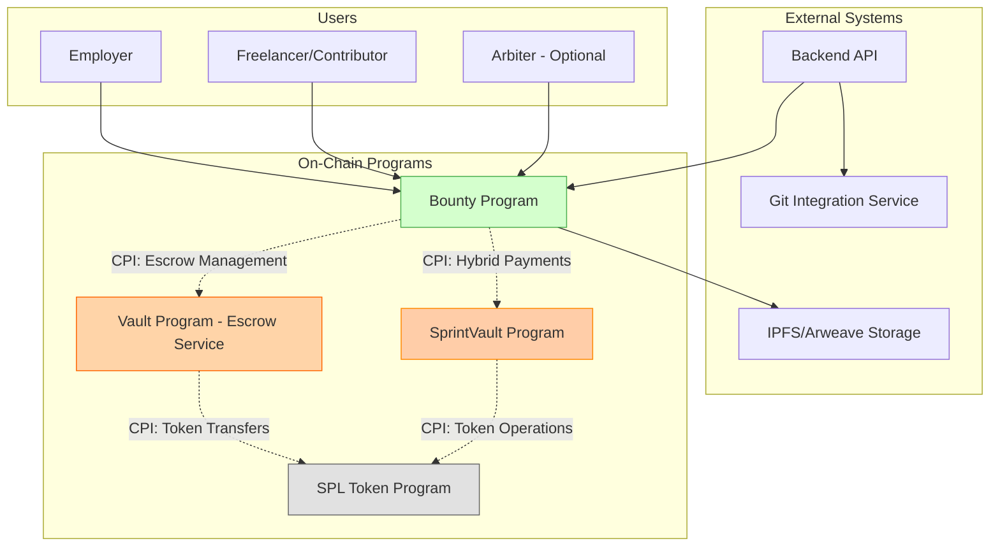
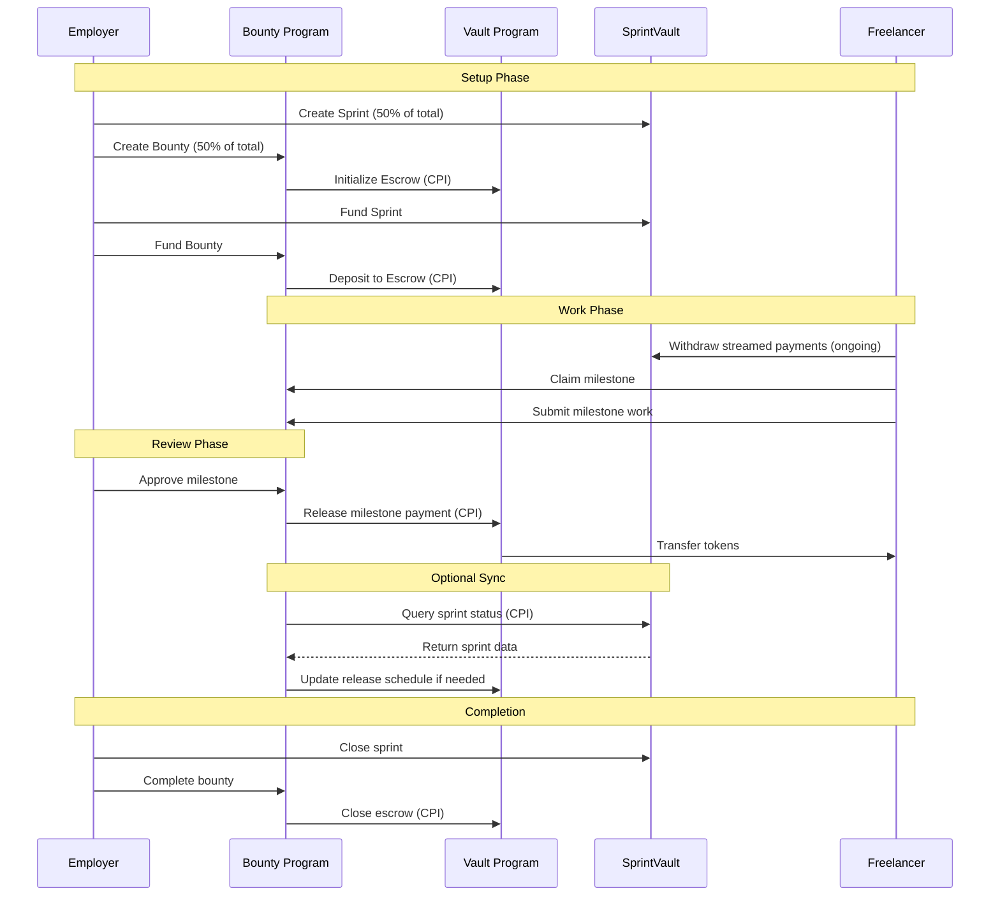
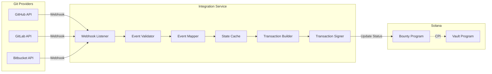

# Bounty Program - Milestone-Based Completion Tracking System with Vault Escrow Integration

## Executive Summary

The Bounty Program is a Solana Anchor program designed to manage milestone-based payments for task-driven work, particularly suited for open-source contributions, bug bounties, and project deliverables. It leverages the **Vault Program** as a separate, specialized escrow service through Cross-Program Invocations (CPIs), providing secure fund management and flexible release schedules.

Unlike the time-streamed payments in SprintVault, the Bounty Program releases funds based on milestone completion, with employers having the authority to approve or reject completed work. The program can operate independently or in conjunction with SprintVault for hybrid payment models.

## Architecture Overview

### Program Interaction Model



### Core Design Principles

1. **Separation of Concerns**: Bounty logic separated from escrow management
2. **Vault Program Integration**: All fund custody delegated to the Vault program
3. **Milestone-Based Release**: Funds released through Vault's milestone schedule
4. **Sprint Compatibility**: Optional integration with SprintVault for hybrid models
5. **External Validation**: Git integration for automated progress tracking
6. **Dispute Resolution**: Arbiter support through Vault's arbiter mechanism

## Data Models

### Account Structures

#### BountyPool Account

```rust
#[account]
pub struct BountyPool {
    // Identity
    pub bounty_id: u64,                    // Unique identifier
    pub employer: Pubkey,                   // Employer who created the bounty

    // Vault Integration
    pub vault_escrow: Pubkey,               // Vault program's EscrowVault PDA
    pub vault_id: u64,                      // Vault ID in the Vault program

    // Configuration
    pub title: String,                      // Bounty title (max 64 chars)
    pub description_url: String,            // IPFS/Arweave URL for full description
    pub total_amount: u64,                  // Total bounty amount
    pub token_mint: Pubkey,                 // SPL token mint

    // Milestones
    pub milestones: Vec<BountyMilestone>,   // List of milestones
    pub current_milestone_index: u8,        // Currently active milestone

    // Sprint Integration (Optional)
    pub associated_sprint: Option<Pubkey>,  // Link to SprintVault sprint
    pub sprint_allocation: Option<u64>,     // Amount allocated from sprint

    // Status
    pub status: BountyStatus,               // Current bounty status
    pub created_at: i64,                    // Creation timestamp
    pub expires_at: Option<i64>,            // Optional expiration

    // Statistics
    pub total_claimed: u32,                 // Number of claims made
    pub total_completed: u32,               // Number of completed milestones
    pub total_paid_out: u64,                // Total amount paid to contributors

    // PDA
    pub bump: u8,                           // PDA bump seed
}

#[derive(AnchorSerialize, AnchorDeserialize, Clone)]
pub struct BountyMilestone {
    pub milestone_id: u32,                  // Unique milestone ID
    pub description: String,                 // Brief description (max 128 chars)
    pub amount: u64,                        // Payment for this milestone
    pub git_criteria: GitCriteria,          // Git-based completion criteria
    pub status: MilestoneStatus,            // Current status
    pub assigned_to: Option<Pubkey>,        // Assigned contributor
    pub submitted_at: Option<i64>,          // Submission timestamp
    pub approved_at: Option<i64>,           // Approval timestamp
    pub evidence_url: Option<String>,       // Link to completion evidence
    pub vault_milestone_id: u32,            // Corresponding ID in Vault program
}
```

#### BountyClaim Account

```rust
#[account]
pub struct BountyClaim {
    pub bounty_pool: Pubkey,                // Associated bounty pool
    pub milestone_id: u32,                  // Milestone being claimed
    pub contributor: Pubkey,                // Contributor claiming
    pub claimed_at: i64,                    // Claim timestamp
    pub status: ClaimStatus,                // Current claim status
    pub submission_url: Option<String>,     // Link to work submission
    pub rejection_reason: Option<String>,   // If rejected, why
    pub attempts: u8,                       // Number of submission attempts
    pub last_updated: i64,                  // Last status update
    pub bump: u8,                           // PDA bump seed
}
```

#### BountyVaultConfig Account

```rust
#[account]
pub struct BountyVaultConfig {
    pub bounty_pool: Pubkey,                // Associated bounty pool
    pub vault_program: Pubkey,              // Vault program ID
    pub vault_escrow: Pubkey,               // Vault's EscrowVault account
    pub total_deposited: u64,               // Total funds sent to vault
    pub total_withdrawn: u64,               // Total withdrawn from vault
    pub pending_releases: Vec<PendingRelease>, // Pending milestone releases
    pub last_sync: i64,                     // Last sync with vault
    pub bump: u8,                           // PDA bump seed
}

#[derive(AnchorSerialize, AnchorDeserialize, Clone)]
pub struct PendingRelease {
    pub milestone_id: u32,
    pub amount: u64,
    pub beneficiary: Pubkey,
    pub requested_at: i64,
}
```

### PDA Derivations

```rust
// Bounty Pool PDA
seeds = [b"bounty_pool", employer.key().as_ref(), bounty_id.to_le_bytes().as_ref()]

// Bounty Claim PDA
seeds = [b"bounty_claim", bounty_pool.key().as_ref(), milestone_id.to_le_bytes().as_ref(), contributor.key().as_ref()]

// Bounty Vault Config PDA
seeds = [b"bounty_vault_config", bounty_pool.key().as_ref()]

// For Vault Program (called via CPI):
// Escrow Vault PDA in Vault program
vault_seeds = [b"escrow_vault", bounty_program.key().as_ref(), bounty_pool.key().as_ref(), vault_id.to_le_bytes().as_ref()]
```

## Instructions

### 1. Create Bounty Pool with Vault Escrow

```rust
pub fn create_bounty_pool(
    ctx: Context<CreateBountyPool>,
    bounty_id: u64,
    vault_id: u64,
    title: String,
    description_url: String,
    total_amount: u64,
    milestones: Vec<MilestoneInput>,
    associated_sprint: Option<Pubkey>,
    expires_at: Option<i64>,
    arbiter: Option<Pubkey>,
) -> Result<()>
```

**Purpose**: Creates a new bounty pool and initializes a corresponding escrow in the Vault program.

**Validation**:

- Title length ≤ 64 characters
- At least one milestone defined
- Sum of milestone amounts equals total_amount
- Expiration date (if set) is in the future
- Associated sprint (if provided) exists and is owned by the same employer

**CPI to Vault Program**:

```rust
// Create escrow in Vault program
let cpi_accounts = CreateEscrow {
    escrow_vault: ctx.accounts.vault_escrow,
    depositor: ctx.accounts.employer,
    beneficiary: ctx.accounts.bounty_pool, // Bounty pool controls releases
    token_mint: ctx.accounts.token_mint,
    vault_token_account: ctx.accounts.vault_token_account,
    system_program: ctx.accounts.system_program,
    token_program: ctx.accounts.token_program,
    rent: ctx.accounts.rent,
};

let cpi_ctx = CpiContext::new(
    ctx.accounts.vault_program.to_account_info(),
    cpi_accounts,
);

// Configure milestone-based release schedule
let release_schedule = ReleaseSchedule::Milestone {
    conditions: milestones.iter().map(|m| MilestoneCondition {
        milestone_id: m.milestone_id,
        amount: m.amount,
        required_approval: ctx.accounts.bounty_pool.key(),
        is_completed: false,
    }).collect(),
};

vault::cpi::create_escrow(
    cpi_ctx,
    vault_id,
    total_amount,
    release_schedule,
    ReleaseAuthority::Program(ctx.accounts.bounty_pool.key()),
    expires_at,
    arbiter,
)?;
```

### 2. Fund Bounty via Vault

```rust
pub fn fund_bounty(
    ctx: Context<FundBounty>,
    amount: u64,
) -> Result<()>
```

**Purpose**: Deposits funds into the Vault program's escrow.

**CPI to Vault Program**:

```rust
let cpi_accounts = DepositFunds {
    escrow_vault: ctx.accounts.vault_escrow,
    depositor: ctx.accounts.employer,
    depositor_token_account: ctx.accounts.employer_token_account,
    vault_token_account: ctx.accounts.vault_token_account,
    token_program: ctx.accounts.token_program,
};

let cpi_ctx = CpiContext::new(
    ctx.accounts.vault_program.to_account_info(),
    cpi_accounts,
);

vault::cpi::deposit_funds(cpi_ctx, amount)?;
```

### 3. Claim Milestone

```rust
pub fn claim_milestone(
    ctx: Context<ClaimMilestone>,
    milestone_id: u32,
) -> Result<()>
```

**Purpose**: Allows a contributor to claim a specific milestone.

**Validation**:

- Milestone exists and is open
- Contributor hasn't already claimed this milestone
- Bounty is active and funded (check with Vault)
- No other active claims on this milestone

### 4. Submit Milestone

```rust
pub fn submit_milestone(
    ctx: Context<SubmitMilestone>,
    milestone_id: u32,
    evidence_url: String,
    git_reference: String,
) -> Result<()>
```

**Purpose**: Contributor submits completed work for review.

**Validation**:

- Contributor has an active claim on this milestone
- Milestone hasn't already been submitted
- Evidence URL is valid (IPFS/Arweave hash)
- Git reference matches expected format

### 5. Approve Milestone and Release Funds

```rust
pub fn approve_milestone(
    ctx: Context<ApproveMilestone>,
    milestone_id: u32,
) -> Result<()>
```

**Purpose**: Employer approves a submitted milestone, triggering payment through Vault.

**CPI to Vault Program**:

```rust
// Release milestone funds from Vault
let cpi_accounts = ReleaseMilestone {
    escrow_vault: ctx.accounts.vault_escrow,
    authority: ctx.accounts.bounty_pool, // Bounty pool is the authority
    beneficiary: ctx.accounts.contributor,
    beneficiary_token_account: ctx.accounts.contributor_token_account,
    vault_token_account: ctx.accounts.vault_token_account,
    token_program: ctx.accounts.token_program,
};

let signer_seeds: &[&[&[u8]]] = &[&[
    b"bounty_pool",
    ctx.accounts.employer.key().as_ref(),
    &ctx.accounts.bounty_pool.bounty_id.to_le_bytes(),
    &[ctx.accounts.bounty_pool.bump],
]];

let cpi_ctx = CpiContext::new_with_signer(
    ctx.accounts.vault_program.to_account_info(),
    cpi_accounts,
    signer_seeds,
);

vault::cpi::release_milestone(cpi_ctx, vault_milestone_id)?;
```

### 6. Reject Milestone

```rust
pub fn reject_milestone(
    ctx: Context<RejectMilestone>,
    milestone_id: u32,
    reason: String,
) -> Result<()>
```

**Purpose**: Employer rejects a submitted milestone.

**Actions**:

- Updates milestone status to Open (allowing re-claim)
- Updates claim status to Rejected
- Stores rejection reason
- Does NOT interact with Vault (funds remain locked)

### 7. Cancel Bounty and Refund

```rust
pub fn cancel_bounty(
    ctx: Context<CancelBounty>,
) -> Result<()>
```

**Purpose**: Cancels an active bounty and refunds remaining funds through Vault.

**CPI to Vault Program**:

```rust
// Close escrow and refund to employer
let cpi_accounts = CloseEscrow {
    escrow_vault: ctx.accounts.vault_escrow,
    authority: ctx.accounts.bounty_pool,
    depositor: ctx.accounts.employer,
    depositor_token_account: ctx.accounts.employer_token_account,
    vault_token_account: ctx.accounts.vault_token_account,
    token_program: ctx.accounts.token_program,
};

let cpi_ctx = CpiContext::new_with_signer(
    ctx.accounts.vault_program.to_account_info(),
    cpi_accounts,
    signer_seeds,
);

vault::cpi::close_escrow(cpi_ctx)?;
```

### 8. Sync with Sprint (Hybrid Model)

```rust
pub fn sync_with_sprint(
    ctx: Context<SyncWithSprint>,
) -> Result<()>
```

**Purpose**: For bounties associated with sprints, synchronizes payment states and optionally transfers sprint funds to vault.

**Validation**:

- Bounty has associated sprint
- Caller is authorized (employer or bounty program)
- Sprint exists and is active

**Actions**:

- Query sprint status via CPI to SprintVault
- Optionally transfer accumulated sprint funds to Vault escrow
- Update bounty pool's sprint_allocation field
- Emit synchronization event

## Integration with SprintVault

### Hybrid Payment Model Architecture

The Bounty Program supports three integration modes with SprintVault:

#### 1. Independent Mode

- Bounty operates completely separately from any sprint
- All funds managed through Vault program
- No interaction with SprintVault

#### 2. Linked Mode

- Bounty is associated with a sprint for tracking purposes
- Funds are managed separately (sprint funds vs bounty funds)
- Status synchronization between programs

#### 3. Hybrid Mode

- Combines time-based streaming (sprint) with milestone payments (bounty)
- Funds can flow from sprint to bounty vault
- Unified payment experience for contributors

### Hybrid Payment Flow



### Cross-Program Invocation Interfaces

#### From Bounty to SprintVault

```rust
// Query sprint status
pub fn query_sprint_status(
    ctx: Context<QuerySprintStatus>,
    sprint_id: Pubkey,
) -> Result<SprintInfo> {
    let cpi_accounts = GetSprintInfo {
        sprint: ctx.accounts.sprint,
        employer: ctx.accounts.employer,
    };

    let cpi_ctx = CpiContext::new(
        ctx.accounts.sprint_vault_program.to_account_info(),
        cpi_accounts,
    );

    sprint_vault::cpi::get_sprint_info(cpi_ctx)
}

// Transfer sprint allocation to bounty
pub fn transfer_sprint_allocation(
    ctx: Context<TransferSprintAllocation>,
    amount: u64,
) -> Result<()> {
    // First: Withdraw from sprint to temp account
    let withdraw_accounts = WithdrawFromSprint {
        sprint: ctx.accounts.sprint,
        employer: ctx.accounts.employer,
        recipient: ctx.accounts.temp_token_account,
        // ... other accounts
    };

    sprint_vault::cpi::withdraw_employer_allocation(
        CpiContext::new(/* ... */),
        amount,
    )?;

    // Then: Deposit to Vault escrow
    vault::cpi::deposit_funds(/* ... */)?;

    Ok(())
}
```

#### From SprintVault to Bounty

```rust
// SprintVault can query bounty progress
pub fn get_bounty_progress(
    ctx: Context<GetBountyProgress>,
    bounty_id: Pubkey,
) -> Result<BountyProgress> {
    let bounty_pool = &ctx.accounts.bounty_pool;

    Ok(BountyProgress {
        total_milestones: bounty_pool.milestones.len() as u32,
        completed_milestones: bounty_pool.total_completed,
        total_amount: bounty_pool.total_amount,
        paid_amount: bounty_pool.total_paid_out,
        status: bounty_pool.status.clone(),
    })
}
```

## External System Integration

### Git Integration Service Architecture



### Integration Flow

1. **Webhook Registration**: Service registers webhooks for relevant events
2. **Event Reception**: Receives PR merged, issue closed, commit pushed events
3. **Validation**: Validates webhook signatures and event authenticity
4. **Mapping**: Maps Git events to bounty milestones
5. **State Check**: Verifies current on-chain state via RPC
6. **Transaction Building**: Constructs appropriate Solana transaction
7. **Signing**: Signs with authorized service keypair
8. **Submission**: Submits transaction to Solana network
9. **Confirmation**: Waits for confirmation and updates cache

### Git Event Handlers

```typescript
interface GitEventHandler {
    async handlePullRequestMerged(event: PRMergedEvent): Promise<void> {
        const milestone = await this.findMilestoneByGitRef(event.pr_number);
        if (milestone && milestone.git_criteria.type === 'PullRequest') {
            await this.updateMilestoneStatus(
                milestone.bounty_id,
                milestone.id,
                'ReadyForApproval',
                event.merge_commit_sha
            );
        }
    }

    async handleIssueCompleted(event: IssueClosedEvent): Promise<void> {
        // Similar logic for issues
    }
}
```

## Security Considerations

### Multi-Layer Security Model

1. **Program Level Security**

   - Owner validation for all sensitive operations
   - State machine enforcement for valid transitions
   - Arithmetic overflow protection

2. **Vault Integration Security**

   - All funds custody delegated to audited Vault program
   - PDA seeds prevent unauthorized access
   - CPI signature verification

3. **External Service Security**

   - Webhook signature validation
   - Rate limiting and DDoS protection
   - Idempotent operations
   - Event replay protection

4. **User Security**
   - Contributor claim verification
   - Employer approval requirements
   - Arbiter dispute resolution option

### Attack Vector Mitigation

```rust
// Example: Preventing double-spending in milestone approval
pub fn approve_milestone(ctx: Context<ApproveMilestone>, milestone_id: u32) -> Result<()> {
    let bounty_pool = &mut ctx.accounts.bounty_pool;
    let milestone = bounty_pool.milestones
        .iter_mut()
        .find(|m| m.milestone_id == milestone_id)
        .ok_or(BountyError::MilestoneNotFound)?;

    // Prevent double approval
    require!(
        milestone.status != MilestoneStatus::Approved,
        BountyError::MilestoneAlreadyApproved
    );

    // Verify Git criteria if applicable
    if milestone.git_criteria.is_required {
        require!(
            milestone.git_criteria.is_satisfied,
            BountyError::GitCriteriaNotMet
        );
    }

    // Update status BEFORE CPI to prevent reentrancy
    milestone.status = MilestoneStatus::Approved;
    milestone.approved_at = Some(Clock::get()?.unix_timestamp);

    // Now safe to release funds via Vault CPI
    // ...
}
```

## Testing Strategy

### Unit Tests

```typescript
describe("Bounty Program with Vault Integration", () => {
  describe("Bounty Creation", () => {
    it("Should create bounty and initialize vault escrow");
    it("Should validate milestone configuration");
    it("Should reject invalid vault parameters");
    it("Should link to sprint when provided");
  });

  describe("Vault Integration", () => {
    it("Should deposit funds to vault via CPI");
    it("Should release milestone payments through vault");
    it("Should handle vault errors gracefully");
    it("Should refund through vault on cancellation");
  });

  describe("Milestone Workflow", () => {
    it("Should allow claiming open milestones");
    it("Should prevent duplicate claims");
    it("Should validate Git criteria");
    it("Should release funds on approval");
    it("Should handle rejection and re-submission");
  });

  describe("Sprint Integration", () => {
    it("Should query sprint status via CPI");
    it("Should transfer sprint funds to vault");
    it("Should synchronize payment states");
    it("Should handle sprint closure");
  });

  describe("Security", () => {
    it("Should prevent unauthorized operations");
    it("Should handle arithmetic overflows");
    it("Should prevent double-spending");
    it("Should validate all state transitions");
  });
});
```

### Integration Tests

```typescript
describe("End-to-End Bounty Flow", () => {
  it("Should complete full bounty lifecycle with vault", async () => {
    // 1. Create bounty with vault escrow
    const bountyId = await createBountyWithVault();

    // 2. Fund through vault
    await fundBountyVault(bountyId, amount);

    // 3. Contributor claims milestone
    await claimMilestone(bountyId, milestoneId);

    // 4. Submit work
    await submitMilestone(bountyId, milestoneId, evidence);

    // 5. External service updates Git status
    await updateGitStatus(bountyId, milestoneId, "merged");

    // 6. Employer approves
    await approveMilestone(bountyId, milestoneId);

    // 7. Verify payment through vault
    const balance = await getContributorBalance();
    expect(balance).to.equal(milestoneAmount);
  });

  it("Should handle hybrid sprint-bounty payment", async () => {
    // Create linked sprint and bounty
    const sprintId = await createSprint();
    const bountyId = await createBountyWithSprint(sprintId);

    // Fund both
    await fundSprint(sprintId, sprintAmount);
    await fundBountyVault(bountyId, bountyAmount);

    // Contributor works and withdraws from both
    await withdrawSprintStream(sprintId);
    await completeMilestone(bountyId, milestoneId);

    // Verify total compensation
    const totalReceived = await getTotalContributorPayments();
    expect(totalReceived).to.equal(expectedTotal);
  });
});
```

## Implementation Roadmap

### Phase 1: Core Functionality with Vault Integration

- [x] Design account structures and PDAs
- [ ] Implement Vault program CPI interfaces
- [ ] Create bounty pool with vault escrow initialization
- [ ] Fund bounty through vault deposits
- [ ] Basic claim and submission flow
- [ ] Approval triggering vault milestone release

### Phase 2: SprintVault Integration

- [ ] Design CPI interfaces to SprintVault
- [ ] Implement sprint status queries
- [ ] Add sprint fund transfer capabilities
- [ ] Create hybrid payment model support
- [ ] Test synchronized lifecycle management

### Phase 3: External Integration

- [ ] Design external service authentication
- [ ] Implement signature verification
- [ ] Create Git status update handlers
- [ ] Add webhook event processors
- [ ] Deploy integration service

### Phase 4: Advanced Features

- [ ] Implement dispute resolution via vault arbiter
- [ ] Add reputation tracking system
- [ ] Create bounty templates
- [ ] Add batch operations
- [ ] Implement emergency pause mechanisms

### Phase 5: Testing & Deployment

- [ ] Complete unit test suite
- [ ] Integration tests with Vault program
- [ ] Integration tests with SprintVault
- [ ] External service testing
- [ ] Security audit preparation
- [ ] Devnet deployment and testing
- [ ] Mainnet deployment planning

## Error Handling

```rust
#[error_code]
pub enum BountyError {
    #[msg("Title exceeds maximum length")]
    TitleTooLong,

    #[msg("No milestones defined")]
    NoMilestones,

    #[msg("Milestone amounts don't sum to total")]
    MilestoneAmountMismatch,

    #[msg("Bounty has expired")]
    BountyExpired,

    #[msg("Milestone already claimed")]
    MilestoneAlreadyClaimed,

    #[msg("Not authorized to perform this action")]
    Unauthorized,

    #[msg("Vault CPI failed")]
    VaultCPIFailed,

    #[msg("Sprint CPI failed")]
    SprintCPIFailed,

    #[msg("Invalid Git reference format")]
    InvalidGitReference,

    #[msg("Milestone not yet submitted")]
    MilestoneNotSubmitted,

    #[msg("Invalid external signature")]
    InvalidSignature,

    #[msg("Vault not initialized")]
    VaultNotInitialized,

    #[msg("Sprint association invalid")]
    InvalidSprintAssociation,

    #[msg("Milestone already approved")]
    MilestoneAlreadyApproved,

    #[msg("Cannot cancel with pending reviews")]
    PendingReviews,

    #[msg("Git criteria not satisfied")]
    GitCriteriaNotMet,

    #[msg("Insufficient vault balance")]
    InsufficientVaultBalance,
}
```

## Client SDK Example

```typescript
import { Program, web3, BN } from '@coral-xyz/anchor';
import { BountyProgram } from './types/bounty_program';
import { VaultProgram } from './types/vault_program';

class BountyClient {
    constructor(
        private bountyProgram: Program<BountyProgram>,
        private vaultProgram: Program<VaultProgram>,
        private employer: web3.Keypair
    ) {}

    async createBountyWithVault(
        title: string,
        totalAmount: number,
        milestones: MilestoneInput[],
        tokenMint: web3.PublicKey,
        arbiter?: web3.PublicKey
    ): Promise<{bountyPool: web3.PublicKey, vaultEscrow: web3.PublicKey}> {
        const bountyId = Date.now();
        const vaultId = bountyId; // Use same ID for simplicity

        const [bountyPool] = web3.PublicKey.findProgramAddressSync(
            [
                Buffer.from("bounty_pool"),
                this.employer.publicKey.toBuffer(),
                new BN(bountyId).toArrayLike(Buffer, 'le', 8)
            ],
            this.bountyProgram.programId
        );

        const [vaultEscrow] = web3.PublicKey.findProgramAddressSync(
            [
                Buffer.from("escrow_vault"),
                this.bountyProgram.programId.toBuffer(),
                bountyPool.toBuffer(),
                new BN(vaultId).toArrayLike(Buffer, 'le', 8)
            ],
            this.vaultProgram.programId
        );

        await this.bountyProgram.methods
            .createBountyPool(
                new BN(bountyId),
                new BN(vaultId),
                title,
                "ipfs://description",
                new BN(totalAmount),
                milestones,
                null,
                null,
                arbiter || null
            )
            .accounts({
                bountyPool,
                vaultEscrow,
                employer: this.employer.publicKey,
                tokenMint,
                vaultProgram: this.vaultProgram.programId,
                systemProgram: web3.SystemProgram.programId,
            })
            .signers([this.employer])
            .rpc();

        return { bountyPool, vaultEscrow };
    }

    async fundBounty(
        bountyPool: web3.PublicKey,
        amount: number
    ): Promise<string> {
        const bountyData = await this.bountyProgram.account.bountyPool.fetch(bountyPool);

        const tx = await this.bountyProgram.methods
            .fundBounty(new BN(amount))
            .accounts({
                bountyPool,
                vaultEscrow: bountyData.vaultEscrow,
                employer: this.employer.publicKey,
                employerTokenAccount: /* derive */,
                vaultProgram: this.vaultProgram.programId,
                tokenProgram: /* SPL Token */,
            })
            .signers([this.employer])
            .rpc();

        return tx;
    }

    async approveMilestoneWithVaultRelease(
        bountyPool: web3.PublicKey,
        milestoneId: number,
        contributor: web3.PublicKey
    ): Promise<string> {
        const bountyData = await this.bountyProgram.account.bountyPool.fetch(bountyPool);

        const tx = await this.bountyProgram.methods
            .approveMilestone(milestoneId)
            .accounts({
                bountyPool,
                vaultEscrow: bountyData.vaultEscrow,
                employer: this.employer.publicKey,
                contributor,
                contributorTokenAccount: /* derive */,
                vaultProgram: this.vaultProgram.programId,
                tokenProgram: /* SPL Token */,
            })
            .signers([this.employer])
            .rpc();

        return tx;
    }

    async syncWithSprint(
        bountyPool: web3.PublicKey,
        sprintPda: web3.PublicKey
    ): Promise<void> {
        await this.bountyProgram.methods
            .syncWithSprint()
            .accounts({
                bountyPool,
                sprint: sprintPda,
                sprintVaultProgram: /* SprintVault program ID */,
                employer: this.employer.publicKey,
            })
            .signers([this.employer])
            .rpc();
    }
}
```

## Conclusion

The updated Bounty Program architecture leverages the Vault program as a dedicated escrow service, providing:

### Key Architectural Benefits

1. **Separation of Concerns**: Bounty logic is cleanly separated from escrow management
2. **Reusability**: The Vault program can be used by multiple protocols
3. **Security**: Audited escrow logic reduces attack surface
4. **Flexibility**: Support for various release schedules and authorities
5. **Composability**: Easy integration with SprintVault and other programs

### Integration Advantages

- **With Vault Program**: Secure, audited escrow management with flexible release schedules
- **With SprintVault**: Hybrid payment models combining streaming and milestones
- **With External Services**: Automated Git-based progress tracking

### Technical Improvements

- **CPI Architecture**: Clean cross-program invocation patterns
- **State Management**: Clear separation between bounty state and escrow state
- **Error Handling**: Comprehensive error codes for all failure scenarios
- **Testing Strategy**: Layered testing from unit to integration tests

This design provides a robust foundation for building sophisticated bounty and task-based payment systems on Solana, with the flexibility to support various use cases from bug bounties to complex project deliverables, all while maintaining security through the dedicated Vault escrow service.
