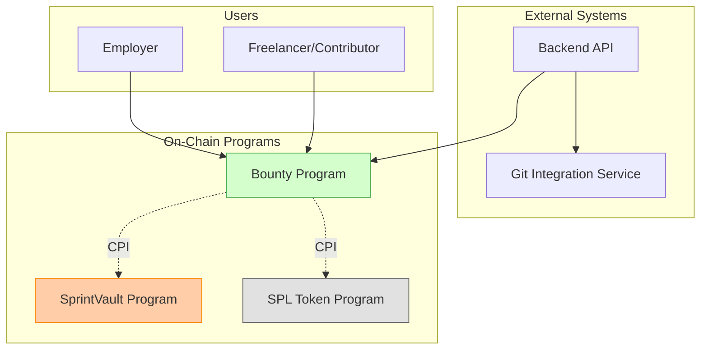
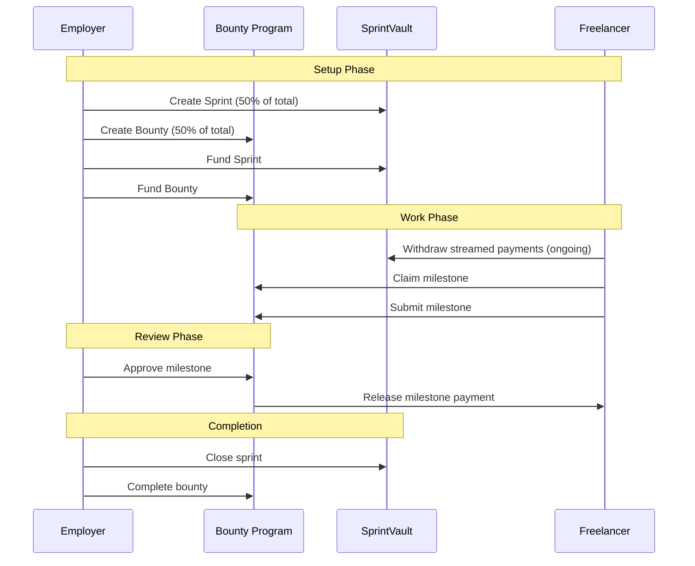
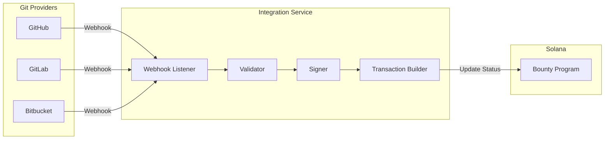
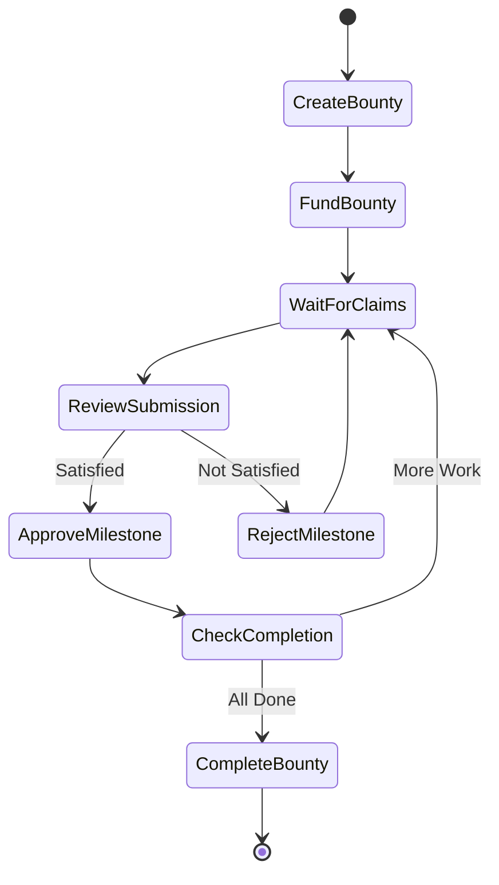
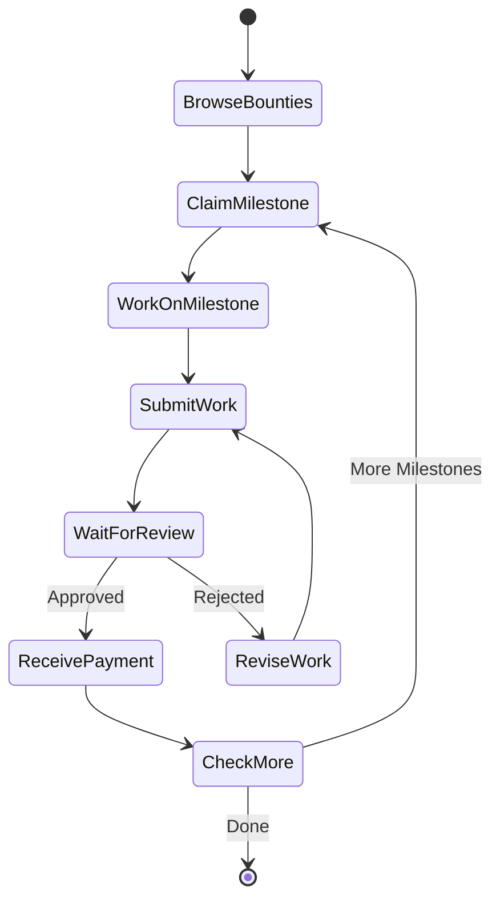

# Bounty Program - Milestone-Based Completion Tracking System

## Executive Summary

The Bounty Program is a Solana Anchor program designed to manage milestone-based payments for task-driven work, particularly suited for open-source contributions, bug bounties, and project deliverables. It operates as a companion to the SprintVault program, enabling employers to create bounties with specific completion criteria and allowing freelancers to claim rewards upon milestone completion.

Unlike the time-streamed payments in SprintVault, the Bounty Program releases funds based on milestone completion, with employers having the authority to approve or reject completed work at the end of each sprint period.

## Architecture Overview

### Program Interaction Model



### Core Design Principles

1. **Milestone-Based Release**: Funds are released only upon milestone completion and employer approval
2. **Sprint Integration**: Each bounty can be associated with a SprintVault sprint for hybrid payment models
3. **External Validation**: An external system interfaces with Git providers to track milestone progress
4. **Employer Authority**: Final approval rests with the employer who funded the bounty
5. **Escrow Security**: Funds are held securely in program-controlled vaults until release conditions are met

## Data Models

### Account Structures

#### BountyPool Account

```rust
#[account]
pub struct BountyPool {
    // Identity
    pub bounty_id: u64,                    // Unique identifier
    pub employer: Pubkey,                   // Employer who created the bounty

    // Configuration
    pub title: String,                      // Bounty title (max 64 chars)
    pub description_url: String,            // IPFS/Arweave URL for full description
    pub total_amount: u64,                  // Total bounty amount
    pub token_mint: Pubkey,                 // SPL token mint

    // Milestones
    pub milestones: Vec<Milestone>,         // List of milestones
    pub current_milestone_index: u8,        // Currently active milestone

    // Sprint Integration (Optional)
    pub associated_sprint: Option<Pubkey>,  // Link to SprintVault sprint

    // Status
    pub status: BountyStatus,               // Current bounty status
    pub created_at: i64,                    // Creation timestamp
    pub expires_at: Option<i64>,            // Optional expiration

    // Vault
    pub vault: Pubkey,                      // Token account holding funds
    pub bump: u8,                           // PDA bump seed
}

#[derive(AnchorSerialize, AnchorDeserialize, Clone)]
pub struct Milestone {
    pub milestone_id: u32,                  // Unique milestone ID
    pub description: String,                 // Brief description (max 128 chars)
    pub amount: u64,                        // Payment for this milestone
    pub git_criteria: GitCriteria,          // Git-based completion criteria
    pub status: MilestoneStatus,            // Current status
    pub assigned_to: Option<Pubkey>,        // Assigned contributor
    pub submitted_at: Option<i64>,          // Submission timestamp
    pub approved_at: Option<i64>,           // Approval timestamp
    pub evidence_url: Option<String>,       // Link to completion evidence
}

#[derive(AnchorSerialize, AnchorDeserialize, Clone)]
pub struct GitCriteria {
    pub criteria_type: GitCriteriaType,     // PR, Issue, Commit, etc.
    pub repository_url: String,             // Repository URL
    pub reference_id: String,                // PR#, Issue#, Commit SHA
    pub required_status: String,            // "merged", "closed", etc.
}

#[derive(AnchorSerialize, AnchorDeserialize, Clone, PartialEq)]
pub enum GitCriteriaType {
    PullRequest,
    Issue,
    Commit,
    Branch,
    Tag,
    Custom,
}

#[derive(AnchorSerialize, AnchorDeserialize, Clone, PartialEq)]
pub enum BountyStatus {
    Active,
    InProgress,
    UnderReview,
    Completed,
    Cancelled,
    Expired,
}

#[derive(AnchorSerialize, AnchorDeserialize, Clone, PartialEq)]
pub enum MilestoneStatus {
    Open,
    Assigned,
    Submitted,
    Approved,
    Rejected,
    Paid,
}
```

#### BountyClaim Account

```rust
#[account]
pub struct BountyClaim {
    pub bounty_pool: Pubkey,                // Associated bounty pool
    pub milestone_id: u32,                  // Milestone being claimed
    pub contributor: Pubkey,                // Contributor claiming
    pub claimed_at: i64,                    // Claim timestamp
    pub status: ClaimStatus,                // Current claim status
    pub submission_url: Option<String>,     // Link to work submission
    pub rejection_reason: Option<String>,   // If rejected, why
    pub bump: u8,                           // PDA bump seed
}

#[derive(AnchorSerialize, AnchorDeserialize, Clone, PartialEq)]
pub enum ClaimStatus {
    Active,
    Submitted,
    Approved,
    Rejected,
    Expired,
    Paid,
}
```

#### BountyEscrow Account

```rust
#[account]
pub struct BountyEscrow {
    pub bounty_pool: Pubkey,                // Associated bounty pool
    pub total_deposited: u64,               // Total funds deposited
    pub total_released: u64,                // Total funds released
    pub total_refunded: u64,                // Total funds refunded
    pub is_fully_funded: bool,              // Whether bounty is fully funded
    pub bump: u8,                           // PDA bump seed
}
```

### PDA Derivations

```rust
// Bounty Pool PDA
seeds = [b"bounty_pool", employer.key().as_ref(), bounty_id.to_le_bytes().as_ref()]

// Bounty Claim PDA
seeds = [b"bounty_claim", bounty_pool.key().as_ref(), milestone_id.to_le_bytes().as_ref(), contributor.key().as_ref()]

// Bounty Escrow PDA
seeds = [b"bounty_escrow", bounty_pool.key().as_ref()]

// Vault Token Account
seeds = [b"bounty_vault", bounty_pool.key().as_ref()]
```

## Instructions

### 1. Create Bounty Pool

```rust
pub fn create_bounty_pool(
    ctx: Context<CreateBountyPool>,
    bounty_id: u64,
    title: String,
    description_url: String,
    total_amount: u64,
    milestones: Vec<MilestoneInput>,
    associated_sprint: Option<Pubkey>,
    expires_at: Option<i64>,
) -> Result<()>
```

**Purpose**: Creates a new bounty pool with defined milestones and criteria.

**Validation**:

- Title length ≤ 64 characters
- At least one milestone defined
- Sum of milestone amounts equals total_amount
- Expiration date (if set) is in the future
- Associated sprint (if provided) exists and is owned by the same employer

### 2. Fund Bounty

```rust
pub fn fund_bounty(
    ctx: Context<FundBounty>,
    amount: u64,
) -> Result<()>
```

**Purpose**: Deposits funds into the bounty escrow vault.

**Validation**:

- Employer has sufficient token balance
- Amount doesn't exceed remaining unfunded amount
- Token mint matches bounty configuration

### 3. Claim Milestone

```rust
pub fn claim_milestone(
    ctx: Context<ClaimMilestone>,
    milestone_id: u32,
) -> Result<()>
```

**Purpose**: Allows a contributor to claim a specific milestone.

**Validation**:

- Milestone exists and is open
- Contributor hasn't already claimed this milestone
- Bounty is active and funded
- No other active claims on this milestone (unless multi-assignee is enabled)

### 4. Submit Milestone

```rust
pub fn submit_milestone(
    ctx: Context<SubmitMilestone>,
    milestone_id: u32,
    evidence_url: String,
    git_reference: String,
) -> Result<()>
```

**Purpose**: Contributor submits completed work for review.

**Validation**:

- Contributor has an active claim on this milestone
- Milestone hasn't already been submitted
- Evidence URL is valid
- Git reference matches expected format

### 5. Update Milestone Status (External)

```rust
pub fn update_milestone_git_status(
    ctx: Context<UpdateMilestoneGitStatus>,
    milestone_id: u32,
    git_status: GitStatus,
    verification_signature: Vec<u8>,
) -> Result<()>
```

**Purpose**: External system updates the Git-based status of a milestone.

**Validation**:

- Caller is authorized external service
- Signature validates against known public key
- Git status update is valid for milestone criteria

### 6. Approve Milestone

```rust
pub fn approve_milestone(
    ctx: Context<ApproveMilestone>,
    milestone_id: u32,
) -> Result<()>
```

**Purpose**: Employer approves a submitted milestone, triggering payment.

**Validation**:

- Caller is the employer
- Milestone has been submitted
- Git criteria (if any) are met
- Sufficient funds in escrow

**Actions**:

- Transfers milestone amount from escrow to contributor
- Updates milestone status to Approved
- Updates claim status to Paid
- Emits MilestoneApproved event

### 7. Reject Milestone

```rust
pub fn reject_milestone(
    ctx: Context<RejectMilestone>,
    milestone_id: u32,
    reason: String,
) -> Result<()>
```

**Purpose**: Employer rejects a submitted milestone.

**Validation**:

- Caller is the employer
- Milestone has been submitted
- Reason provided (max 256 chars)

**Actions**:

- Updates milestone status to Open (allowing re-claim)
- Updates claim status to Rejected
- Stores rejection reason
- Emits MilestoneRejected event

### 8. Cancel Bounty

```rust
pub fn cancel_bounty(
    ctx: Context<CancelBounty>,
) -> Result<()>
```

**Purpose**: Cancels an active bounty and refunds remaining funds.

**Validation**:

- Caller is the employer
- No milestones are currently under review
- Bounty is not already completed or cancelled

**Actions**:

- Refunds all unallocated funds to employer
- Updates bounty status to Cancelled
- Closes bounty accounts if empty

### 9. Withdraw from Sprint (CPI)

```rust
pub fn withdraw_sprint_allocation(
    ctx: Context<WithdrawSprintAllocation>,
) -> Result<()>
```

**Purpose**: For bounties associated with sprints, allows withdrawal of time-based allocation.

**Validation**:

- Bounty has associated sprint
- Caller is authorized (employer or approved contributor)
- Sprint has available funds

**Actions**:

- Makes CPI to SprintVault program
- Withdraws earned amount to bounty escrow
- Updates internal accounting

## Integration with SprintVault

### Hybrid Payment Model

The Bounty Program can work in conjunction with SprintVault to create hybrid payment models:



### CPI Interactions

The Bounty Program can make Cross-Program Invocations to SprintVault for:

1. **Checking Sprint Status**: Verify associated sprint is active
2. **Withdrawing Allocations**: Pull funds from sprint for milestone payments
3. **Pausing on Disputes**: Trigger sprint pause if milestone is rejected
4. **Syncing Completion**: Mark sprint as complete when all milestones are done

## External System Integration

### Git Integration Service

The external Git integration service acts as a bridge between Git providers and the Solana blockchain:



### Integration Flow

1. **Webhook Registration**: Service registers webhooks with Git providers
2. **Event Reception**: Receives events (PR merged, issue closed, etc.)
3. **Validation**: Validates event authenticity and relevance
4. **Transaction Building**: Constructs Solana transaction with status update
5. **Signing**: Signs with authorized keypair
6. **Submission**: Submits transaction to Solana network

### Security Considerations

1. **Signature Verification**: All external updates must be signed
2. **Rate Limiting**: Prevent spam updates
3. **Idempotency**: Duplicate events don't cause issues
4. **Audit Trail**: All updates are logged on-chain

## User Flows

### Employer Flow



### Contributor Flow



## Implementation Roadmap

### Phase 1: Core Functionality

- [ ] Account structures and PDAs
- [ ] Create bounty pool instruction
- [ ] Fund bounty instruction
- [ ] Basic claim and submission flow
- [ ] Approval and payment logic

### Phase 2: SprintVault Integration

- [ ] CPI to SprintVault for status checks
- [ ] Hybrid payment model support
- [ ] Synchronized sprint/bounty lifecycle
- [ ] Shared escrow management

### Phase 3: External Integration

- [ ] External service authorization
- [ ] Signature verification for updates
- [ ] Git status update instructions
- [ ] Event emission for indexing

### Phase 4: Advanced Features

- [ ] Dispute resolution mechanism
- [ ] Reputation tracking

### Phase 5: Testing & Deployment

- [ ] Unit tests for all instructions
- [ ] Integration tests with SprintVault
- [ ] External service mock testing
- [ ] Security audit preparation
- [ ] Devnet deployment

## Error Handling

```rust
#[error_code]
pub enum BountyError {
    #[msg("Title exceeds maximum length")]
    TitleTooLong,

    #[msg("No milestones defined")]
    NoMilestones,

    #[msg("Milestone amounts don't sum to total")]
    MilestoneAmountMismatch,

    #[msg("Bounty has expired")]
    BountyExpired,

    #[msg("Milestone already claimed")]
    MilestoneAlreadyClaimed,

    #[msg("Not authorized to perform this action")]
    Unauthorized,

    #[msg("Insufficient funds in escrow")]
    InsufficientFunds,

    #[msg("Invalid Git reference format")]
    InvalidGitReference,

    #[msg("Milestone not yet submitted")]
    MilestoneNotSubmitted,

    #[msg("Invalid external signature")]
    InvalidSignature,

    #[msg("Bounty not fully funded")]
    BountyNotFunded,

    #[msg("Sprint association invalid")]
    InvalidSprintAssociation,

    #[msg("Milestone already approved")]
    MilestoneAlreadyApproved,

    #[msg("Cannot cancel with pending reviews")]
    PendingReviews,
}
```

## Security Considerations

### Access Control

1. **Employer Authority**: Only employers can approve/reject milestones
2. **Contributor Rights**: Only claim holders can submit work
3. **External Service Auth**: Signed updates from authorized services only

### Fund Safety

1. **Escrow Protection**: Funds locked until approval
2. **Atomic Transfers**: All token transfers are atomic
3. **Refund Mechanism**: Clear refund path for cancelled bounties

### Data Integrity

1. **Immutable History**: All actions recorded on-chain
2. **Timestamp Verification**: Use Solana clock for timing
3. **Status Transitions**: Valid state machine transitions only

## Testing Strategy

### Unit Tests

```typescript
describe("Bounty Program", () => {
  describe("Create Bounty", () => {
    it("Should create bounty with valid milestones");
    it("Should reject bounty with invalid milestone sum");
    it("Should link to existing sprint");
  });

  describe("Milestone Claims", () => {
    it("Should allow claiming open milestone");
    it("Should prevent duplicate claims");
    it("Should enforce expiration");
  });

  describe("Milestone Approval", () => {
    it("Should release funds on approval");
    it("Should handle rejection with reason");
    it("Should verify Git criteria met");
  });

  describe("External Updates", () => {
    it("Should accept valid signed updates");
    it("Should reject invalid signatures");
    it("Should update Git status correctly");
  });
});
```

### Integration Tests

```typescript
describe("Bounty-Sprint Integration", () => {
  it("Should create linked bounty and sprint");
  it("Should withdraw from sprint to bounty");
  it("Should pause sprint on milestone rejection");
  it("Should complete both on success");
});
```

## Client SDK Example

```typescript
import { Program, web3, BN } from '@coral-xyz/anchor';
import { BountyProgram } from './types/bounty_program';

class BountyClient {
  constructor(
    private program: Program<BountyProgram>,
    private employer: web3.Keypair
  ) {}

  async createBounty(
    title: string,
    totalAmount: number,
    milestones: MilestoneInput[],
    tokenMint: web3.PublicKey
  ): Promise<web3.PublicKey> {
    const bountyId = Date.now();

    const [bountyPool] = web3.PublicKey.findProgramAddressSync(
      [
        Buffer.from("bounty_pool"),
        this.employer.publicKey.toBuffer(),
        new BN(bountyId).toArrayLike(Buffer, 'le', 8)
      ],
      this.program.programId
    );

    await this.program.methods
      .createBountyPool(
        new BN(bountyId),
        title,
        "ipfs://description",
        new BN(totalAmount),
        milestones,
        null,
        null
      )
      .accounts({
        bountyPool,
        employer: this.employer.publicKey,
        tokenMint,
        systemProgram: web3.SystemProgram.programId,
      })
      .signers([this.employer])
      .rpc();

    return bountyPool;
  }

  async fundBounty(
    bountyPool: web3.PublicKey,
    amount: number
  ): Promise<string> {
    const [escrow] = web3.PublicKey.findProgramAddressSync(
      [Buffer.from("bounty_escrow"), bountyPool.toBuffer()],
      this.program.programId
    );

    const tx = await this.program.methods
      .fundBounty(new BN(amount))
      .accounts({
        bountyPool,
        escrow,
        employer: this.employer.publicKey,
        employerTokenAccount: /* ... */,
        vault: /* ... */,
        tokenProgram: /* ... */,
      })
      .signers([this.employer])
      .rpc();

    return tx;
  }

  async approveMilestone(
    bountyPool: web3.PublicKey,
    milestoneId: number
  ): Promise<string> {
    const tx = await this.program.methods
      .approveMilestone(milestoneId)
      .accounts({
        bountyPool,
        employer: this.employer.publicKey,
        contributor: /* ... */,
        contributorTokenAccount: /* ... */,
        vault: /* ... */,
        tokenProgram: /* ... */,
      })
      .signers([this.employer])
      .rpc();

    return tx;
  }
}
```

## Conclusion

The Bounty Program provides a robust, flexible system for managing milestone-based payments on Solana. By integrating with SprintVault, it enables hybrid payment models that combine time-based streaming with milestone achievements. The external Git integration allows for automated tracking of open-source contributions while maintaining employer authority over final approval.

Key benefits:

- **Flexibility**: Supports various milestone types and criteria
- **Security**: Funds held in escrow until conditions met
- **Integration**: Works seamlessly with SprintVault
- **Transparency**: All actions recorded on-chain
- **Automation**: External systems can update progress
- **Control**: Employers retain final approval authority

This design provides a foundation for building sophisticated bounty and task-based payment systems on Solana, suitable for everything from bug bounties to complex project deliverables.
