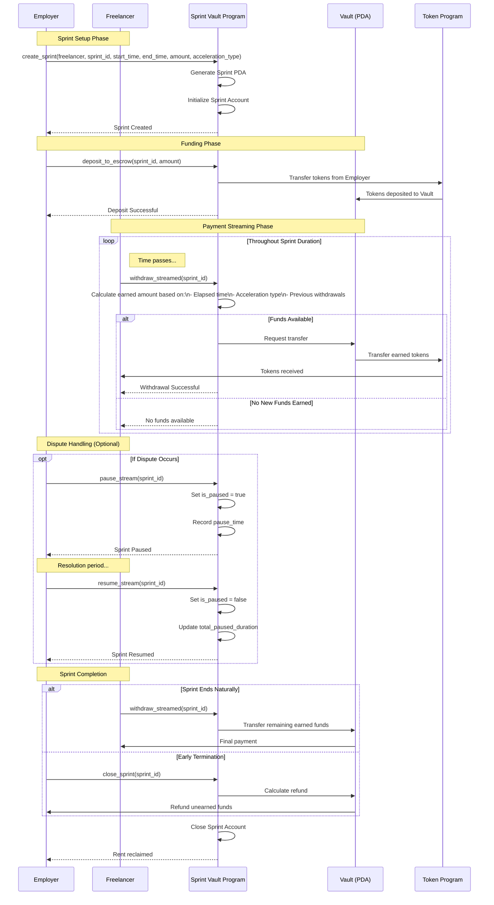

# Sprint Vault Solana Program - Capstone Project

## Executive Summary

The Sprint Vault program is a decentralized payment system on Solana that enables milestone-based and time-streamed payments between employers and freelancers. This document outlines the implementation plan, architectural decisions, and comprehensive test suite for the program.

## Plan

### 1. Implementation Strategy

#### 1.1 Program Structure

Based on the [architecture document](../Q32025-3-Architecture.md), I'll implement a modular system with the following core components:

1. **Core Sprint & Vault Module** (`lib.rs` and supporting modules)

   - Main program entry point
   - Instruction handlers for sprint lifecycle
   - Escrow management logic

2. **State Management** (`state.rs`)

   - Sprint account structure
   - Vault configuration
   - User profile tracking

3. **Instructions Module** (`instructions/`)

   - `create_sprint.rs` - Initialize a new payment sprint
   - `deposit_to_escrow.rs` - Fund the sprint vault
   - `withdraw_streamed.rs` - Claim earned payments
   - `pause_stream.rs` - Handle dispute initiation
   - `resume_stream.rs` - Resume after dispute resolution
   - `close_sprint.rs` - Finalize and cleanup

4. **Error Handling** (`errors.rs`)

   - Custom error types for various failure scenarios
   - Clear error messages for debugging

5. **Utils Module** (`utils.rs`)
   - Time calculation helpers
   - Payment streaming calculations
   - Validation utilities

#### 1.2 Account Architecture

##### Program-Derived Addresses (PDAs)

1. **Sprint PDA**

   - Seeds: `[b"sprint", employer.key().as_ref(), sprint_id.to_le_bytes().as_ref()]`
   - Stores: sprint metadata, timing, amounts, status
   - Unique per employer-sprint combination

2. **Vault Token Account**

   - Authority: Sprint PDA
   - Holds escrowed funds
   - SPL Token account for USDC/SOL

3. **User Profile PDA** (optional enhancement)
   - Seeds: `[b"user", user.key().as_ref()]`
   - Stores: reputation, completed sprints, dispute history

##### Account Relationships

```
Employer Wallet ─── funds ──→ Vault Token Account
                                     ↑
                                   owned by
                                     │
                                Sprint PDA ─── streams to ──→ Freelancer Wallet
```

#### 1.3 Implementation Phases

##### Phase 1: Core Infrastructure (Phase 1)

- [x] Project setup with Anchor
- [x] Define account structures
- [x] Implement Sprint PDA creation
- [x] Basic error handling

##### Phase 2: Payment Flow (Phase 2)

- [x] Create sprint instruction
- [x] Deposit to escrow functionality
- [x] Time-based streaming calculations
- [x] Withdrawal mechanism

##### Phase 3: Advanced Features (Phase 3)

- [x] Pause/resume functionality
- [x] Auto-refund mechanism
- [x] Sprint closure and cleanup
- [x] Enhanced validation

##### Phase 4: Testing & Documentation (Phase 4)

- [x] Comprehensive test suite
- [x] Integration tests
- [x] Documentation
- [ ] Security audit preparation

### 2. Technical Decisions

#### 2.1 Time Management

- Use Solana's Clock sysvar for on-chain time
- Store timestamps as `i64` Unix timestamps
- Calculate streaming amounts using linear interpolation

#### 2.2 Token Handling

- Support SPL tokens (primarily USDC)
- Use Associated Token Accounts (ATAs) for user wallets
- Implement proper CPI for token transfers

#### 2.3 Security Considerations

- **Reentrancy Protection**: Use Anchor's built-in account validation
- **Overflow Protection**: Use checked arithmetic operations
- **Authority Validation**: Strict signer checks on all sensitive operations
- **PDA Validation**: Verify PDA derivation in all instructions

#### 2.4 Gas Optimization

- Minimize account size by using efficient data structures
- Close unused accounts to reclaim rent
- Batch operations where possible

### 3. Data Models

#### Sprint Account Structure

```rust
#[account]
pub struct Sprint {
    pub employer: Pubkey,           // 32 bytes
    pub freelancer: Pubkey,         // 32 bytes
    pub sprint_id: u64,             // 8 bytes
    pub start_time: i64,            // 8 bytes
    pub end_time: i64,              // 8 bytes
    pub total_amount: u64,          // 8 bytes
    pub withdrawn_amount: u64,      // 8 bytes
    pub release_rate: u64,          // 8 bytes (tokens per second)
    pub is_paused: bool,            // 1 byte
    pub pause_time: Option<i64>,    // 9 bytes
    pub mint: Pubkey,               // 32 bytes
    pub vault: Pubkey,              // 32 bytes
    pub bump: u8,                   // 1 byte
}
```

#### Sprint Status Enum

```rust
pub enum SprintStatus {
    Active,
    Paused,
    Completed,
    Cancelled,
}
```

## Test Plan

### 1. Unit Tests

#### 1.1 Sprint Creation Tests

- **Test: Create Sprint Success**

  - Setup: Valid employer and freelancer accounts
  - Action: Call `create_sprint` with valid parameters
  - Expected: Sprint PDA created with correct initial state
  - Validation: Verify all fields match input parameters

- **Test: Create Sprint Invalid Duration**

  - Setup: End time before start time
  - Action: Call `create_sprint`
  - Expected: Error `InvalidTimeRange`

- **Test: Create Sprint Duplicate**
  - Setup: Existing sprint with same ID
  - Action: Call `create_sprint` with duplicate ID
  - Expected: Error `SprintAlreadyExists`

#### 1.2 Deposit Tests

- **Test: Successful Deposit**

  - Setup: Valid sprint, employer with sufficient balance
  - Action: Call `deposit_to_escrow` with amount
  - Expected: Funds transferred to vault, sprint funded status updated
  - Validation: Check vault balance, employer balance decreased

- **Test: Insufficient Balance**

  - Setup: Employer with balance < deposit amount
  - Action: Call `deposit_to_escrow`
  - Expected: Error `InsufficientFunds`

- **Test: Wrong Token Type**
  - Setup: Sprint expecting USDC, deposit SOL
  - Action: Call `deposit_to_escrow` with wrong mint
  - Expected: Error `InvalidMint`

#### 1.3 Withdrawal Tests

- **Test: Valid Withdrawal Mid-Sprint**

  - Setup: Active sprint, 50% time elapsed
  - Action: Freelancer calls `withdraw_streamed`
  - Expected: 50% of funds transferred
  - Validation: Verify calculation, update withdrawn_amount

- **Test: Withdrawal When Paused**

  - Setup: Paused sprint
  - Action: Call `withdraw_streamed`
  - Expected: Error `SprintPaused`

- **Test: Withdrawal After Sprint End**

  - Setup: Sprint ended, funds remaining
  - Action: Call `withdraw_streamed`
  - Expected: All remaining funds transferred

- **Test: Double Withdrawal Prevention**
  - Setup: Withdraw once, try again immediately
  - Action: Second `withdraw_streamed` call
  - Expected: Zero amount or error `NoFundsAvailable`

#### 1.4 Pause/Resume Tests

- **Test: Employer Pause Sprint**

  - Setup: Active sprint
  - Action: Employer calls `pause_stream`
  - Expected: Sprint paused, pause_time recorded
  - Validation: is_paused = true, withdrawals blocked

- **Test: Unauthorized Pause Attempt**

  - Setup: Active sprint
  - Action: Non-employer calls `pause_stream`
  - Expected: Error `Unauthorized`

- **Test: Resume After Pause**
  - Setup: Paused sprint
  - Action: Authorized party calls `resume_stream`
  - Expected: Sprint active, time adjusted for pause duration

#### 1.5 Edge Cases

- **Test: Zero Amount Sprint**

  - Setup: Create sprint with 0 total_amount
  - Expected: Error `InvalidAmount`

- **Test: Withdrawal Calculation Overflow**

  - Setup: Large amounts that could overflow
  - Expected: Safe handling, no panic

- **Test: Time Manipulation Resistance**
  - Setup: Try to withdraw with manipulated clock
  - Expected: Use on-chain clock only

### 2. Integration Tests

#### 2.1 Complete Sprint Lifecycle

```typescript
describe("Sprint Lifecycle Integration", () => {
  it("Should complete full sprint flow", async () => {
    // 1. Create sprint
    // 2. Deposit funds
    // 3. Wait for time to pass
    // 4. Partial withdrawal
    // 5. Complete sprint
    // 6. Final withdrawal
    // 7. Close sprint
  });
});
```

#### 2.2 Dispute Resolution Flow

```typescript
describe("Dispute Handling", () => {
  it("Should handle pause and resolution", async () => {
    // 1. Create and fund sprint
    // 2. Freelancer withdraws partial
    // 3. Employer pauses
    // 4. Verify withdrawal blocked
    // 5. Resume sprint
    // 6. Verify withdrawal enabled
  });
});
```

#### 2.3 Multi-Sprint Management

```typescript
describe("Multiple Sprints", () => {
  it("Should manage multiple concurrent sprints", async () => {
    // 1. Create 3 sprints with different parameters
    // 2. Fund all sprints
    // 3. Withdraw from each at different times
    // 4. Verify isolation between sprints
  });
});
```

### 3. Security Tests

#### 3.1 Access Control

- Verify only employer can pause
- Verify only freelancer can withdraw
- Verify only employer can close early

#### 3.2 Reentrancy Protection

- Attempt recursive withdrawal calls
- Verify state updates before transfers

#### 3.3 Integer Overflow/Underflow

- Test with maximum u64 values
- Test withdrawal calculations near boundaries

### 4. Performance Tests

#### 4.1 Gas Usage

- Measure compute units for each instruction
- Optimize where usage exceeds thresholds

#### 4.2 Account Size

- Verify accounts stay within size limits
- Test with maximum data fields

### 5. Test Utilities

#### Mock Helpers

```typescript
// Time advancement helper
async function advanceTimeBy(seconds: number) {
  // Implementation for test environment
}

// Token setup helper
async function setupTokenAccounts(
  mint: PublicKey,
  employer: Keypair,
  freelancer: Keypair,
  amount: number
) {
  // Create and fund token accounts
}

// Sprint creation helper
async function createAndFundSprint(
  program: Program,
  employer: Keypair,
  freelancer: PublicKey,
  amount: number,
  duration: number
) {
  // Create sprint and deposit funds
}
```

## Questions

### Business Logic Questions

1. **Fee Structure**: Should the platform charge fees? If so:

   - What percentage?
   - Charged on deposit or withdrawal?
   - Where do fees go?

2. **Sprint Cancellation**: Under what conditions can a sprint be cancelled?

   - Before funding?
   - After funding but before start?
   - During active period?

3. **Grace Period**: Should there be a grace period after sprint end for final withdrawals before auto-refund triggers?

4. **Reputation System**: Should the program track completion rates and dispute history on-chain, or leave this to off-chain indexing?

### Implementation Priority Questions

1. **MVP Scope**: Which features are essential for MVP vs. future enhancements?

   - Core: Create, deposit, withdraw
   - Enhanced: Pause/resume, auto-refund
   - Future: Reputation, multi-token, modifications

2. **Oracle Integration**: The architecture mentions GitHub webhook oracle for bounties. Should this be implemented in the initial version or deferred?

3. **Bounty Program Separation**: Should the bounty functionality be a separate program (as suggested in architecture) or integrated into the sprint vault initially?

## Architectural Decisions

### 1. Chosen Approach: Modular Single Program

After analyzing the architecture document and the current project structure, the implementation will focus on the Sprint & Vault Program as a single, cohesive program initially. This decision is based on:

- **Simplicity**: Easier to develop, test, and audit
- **Efficiency**: Fewer CPIs, lower transaction costs
- **Iterative Development**: Can be refactored into multiple programs later

The program will be structured with clear module separation to facilitate future splitting if needed.

### 2. Time-based Streaming Calculation

The streaming calculation will use linear interpolation:

```
earned_amount = total_amount * (current_time - start_time) / (end_time - start_time)
withdrawable = earned_amount - withdrawn_amount
```

This provides predictable, fair payment distribution.

### 3. Security-First Design

- All arithmetic operations use checked math
- Explicit ownership validation on every instruction
- Account validation through Anchor's type system
- PDA seeds include unique identifiers to prevent collisions

### 4. Upgrade Path

The program will use Anchor's upgradeable deployment by default, allowing for:

- Bug fixes
- Feature additions
- Parameter adjustments

With proper migration strategies for existing sprints.

## Implementation Status

### Current State

- ✅ Anchor project initialized
- ✅ Basic program structure created
- ✅ Architecture analyzed and understood
- ✅ Implementation plan documented
- ✅ Core account structures implemented
- ✅ Sprint initialization instruction created
- ✅ Deposit mechanism implemented
- ✅ Withdrawal functionality added
- ✅ Pause/resume functionality implemented
- ✅ Sprint closure logic completed
- ✅ Program successfully compiled

### Implementation Details

#### Files Created

1. **State Management** (`state.rs`)

   - Sprint account with comprehensive fields for payment tracking
   - Helper methods for calculating earned amounts
   - Pause/resume logic with duration tracking

2. **Instructions** (`instructions/` module)

   - `create_sprint.rs` - Initializes new payment sprints with validation
   - `deposit_to_escrow.rs` - Handles funding of sprint vaults
   - `withdraw_streamed.rs` - Manages time-based payment withdrawals
   - `pause_stream.rs` - Allows employers to pause payment streams
   - `resume_stream.rs` - Resumes paused payment streams
   - `close_sprint.rs` - Finalizes sprints and refunds remaining funds

3. **Error Handling** (`errors.rs`)

   - Comprehensive error types for all failure scenarios
   - Clear error messages for debugging

4. **Utilities** (`utils.rs`)
   - Time validation and calculation helpers
   - Amount validation
   - Clock sysvar integration

### Next Steps

1. Develop comprehensive test suite
2. Create integration tests for full sprint lifecycle
3. Add client-side TypeScript SDK
4. Perform security audit
5. Deploy to devnet for testing

## How To: Setting Up a Sprint with Sprint Vault

### Overview

Sprint Vault enables secure, time-streamed payments between employers and freelancers on Solana. Here's how to set up and manage a sprint from start to finish.

### Prerequisites

1. **Wallets**: Both employer and freelancer need Solana wallets with SOL for transaction fees
2. **Tokens**: Employer needs sufficient SPL tokens (e.g., USDC) to fund the sprint
3. **Program ID**: The deployed Sprint Vault program ID on Solana

### Step-by-Step Process

#### 1. Sprint Creation

The employer initiates a new sprint by calling `create_sprint` with:

- Freelancer's wallet address
- Unique sprint ID
- Start and end timestamps
- Total payment amount
- Token mint (e.g., USDC)
- Acceleration type (Linear, Quadratic, or Cubic - defaults to Quadratic)

#### 2. Funding the Sprint

The employer deposits the full payment amount into escrow:

- Calls `deposit_to_escrow` instruction
- Transfers tokens from employer's wallet to the sprint's vault account
- Funds are now locked and will stream to the freelancer over time

#### 3. Payment Streaming

Once the sprint start time is reached:

- Payments automatically become available based on elapsed time
- The streaming follows the selected acceleration curve:
  - **Linear**: Constant rate over time
  - **Quadratic**: Accelerating payments (slow start, faster end)
  - **Cubic**: Even more accelerated curve

#### 4. Withdrawing Earned Payments

The freelancer can withdraw accumulated payments at any time:

- Calls `withdraw_streamed` instruction
- System calculates earned amount based on:
  - Current time vs sprint timeline
  - Selected acceleration type
  - Amount already withdrawn
- Tokens transfer from vault to freelancer's wallet

#### 5. Handling Disputes (Optional)

If issues arise, the employer can pause the sprint:

- Calls `pause_stream` to temporarily halt payments
- Streaming calculations account for paused duration
- Call `resume_stream` to continue after resolution

#### 6. Sprint Completion

When the sprint ends:

- Freelancer withdraws any remaining earned funds
- Either party can call `close_sprint` to:
  - Refund any unearned funds to employer
  - Close the sprint account
  - Reclaim rent deposits

### Sequence Diagram



### Example Code (TypeScript)

```typescript
import { Program, web3 } from '@coral-xyz/anchor';
import { SprintVault } from './types/sprint_vault';

// 1. Create a Sprint
async function createSprint(
  program: Program<SprintVault>,
  employer: web3.Keypair,
  freelancer: web3.PublicKey,
  sprintId: number,
  duration: number, // in seconds
  amount: number,
  accelerationType: number = 1 // 0=Linear, 1=Quadratic, 2=Cubic
) {
  const now = Math.floor(Date.now() / 1000);
  const startTime = now + 60; // Start in 1 minute
  const endTime = startTime + duration;

  const [sprintPda] = web3.PublicKey.findProgramAddressSync(
    [
      Buffer.from("sprint"),
      employer.publicKey.toBuffer(),
      Buffer.from(sprintId.toString())
    ],
    program.programId
  );

  await program.methods
    .createSprint(
      sprintId,
      new BN(startTime),
      new BN(endTime),
      new BN(amount),
      accelerationType
    )
    .accounts({
      sprint: sprintPda,
      employer: employer.publicKey,
      freelancer: freelancer,
      systemProgram: web3.SystemProgram.programId,
    })
    .signers([employer])
    .rpc();

  return sprintPda;
}

// 2. Fund the Sprint
async function depositToEscrow(
  program: Program<SprintVault>,
  employer: web3.Keypair,
  sprintPda: web3.PublicKey,
  amount: number
) {
  await program.methods
    .depositToEscrow(new BN(amount))
    .accounts({
      sprint: sprintPda,
      employer: employer.publicKey,
      employerTokenAccount: /* employer's token account */,
      vault: /* vault token account */,
      tokenProgram: TOKEN_PROGRAM_ID,
    })
    .signers([employer])
    .rpc();
}

// 3. Withdraw Earned Payments
async function withdrawStreamed(
  program: Program<SprintVault>,
  freelancer: web3.Keypair,
  sprintPda: web3.PublicKey
) {
  const withdrawAmount = await program.methods
    .withdrawStreamed()
    .accounts({
      sprint: sprintPda,
      freelancer: freelancer.publicKey,
      freelancerTokenAccount: /* freelancer's token account */,
      vault: /* vault token account */,
      tokenProgram: TOKEN_PROGRAM_ID,
    })
    .signers([freelancer])
    .rpc();

  return withdrawAmount;
}
```

### Key Features

1. **Trustless Escrow**: Funds are locked in a program-controlled vault
2. **Time-based Streaming**: Payments unlock gradually over the sprint duration
3. **Flexible Acceleration**: Choose how payments accelerate (linear, quadratic, or cubic)
4. **Dispute Protection**: Ability to pause/resume if issues arise
5. **Automatic Refunds**: Unearned funds return to employer at sprint end
6. **On-chain Transparency**: All payment calculations are verifiable on-chain

### Best Practices

1. **Sprint Planning**:

   - Set realistic timelines with some buffer
   - Choose acceleration type based on work pattern
   - Consider smaller sprints for new relationships

2. **For Employers**:

   - Fund sprints promptly after creation
   - Use pause feature judiciously for legitimate disputes
   - Close completed sprints to reclaim rent

3. **For Freelancers**:

   - Withdraw regularly to maintain cash flow
   - Monitor sprint progress and deadlines
   - Communicate proactively to avoid disputes

4. **Security**:
   - Verify program ID before interacting
   - Use hardware wallets for large amounts
   - Test with small amounts first

## Conclusion

The Sprint Vault program represents a significant advancement in decentralized payment systems on Solana. By leveraging Anchor's type safety and Solana's high performance, we can create a robust, secure, and efficient platform for milestone-based payments.

The modular architecture ensures maintainability and upgradability, while the comprehensive test suite will validate all edge cases and security considerations. The implementation follows Solana best practices and optimizes for both user experience and computational efficiency.
