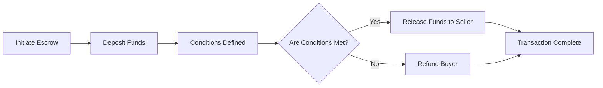

# Escrow

## concept

An _escrow_ is a program that temporarily holds and controls funds or assets until predefined conditions are met. It acts as a neutral third party, ensuring that both parties in a transaction fulfill their obligations before the assets are released.

## actions

1. Initiate Escrow

- Buyer and seller agree to terms (e.g., NFT sale, token swap).
- A Solana smart contract (escrow program) is deployed or reused.

2. Deposit Funds

- Buyer sends funds (SOL/SPL tokens) to the escrow account.
- Funds are locked in the contract until conditions are fulfilled.

3. Conditions Defined

- The contract encodes release logic (e.g., NFT delivery confirmation, expiration time, or multisig approval).

4. Check Conditions

- The contract checks if the agreed-upon conditions (e.g., proof of delivery) are met.
- This can be triggered by:
  - An on-chain event (e.g., NFT transfer).
  - An off-chain oracle or signed message.

5. Release Funds or Refund

   - Conditions Met: Funds are automatically sent to the seller.
   - Conditions Not Met: Funds are returned to the buyer (e.g., if the seller fails to deliver).

6. Transaction Complete

- The escrow account closes, and both parties receive confirmation on-chain.
